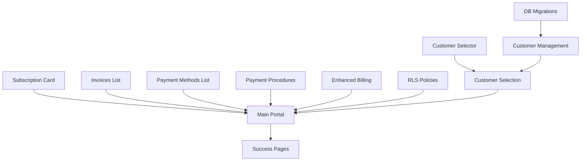

# Billing Portal Migration - PR Breakdown & Parallelization Strategy

## Migration Context & Goals

### Current State Problems
We currently have billing components packaged in the `@flowglad/react` library (`packages/react/src/components/`), which presents several challenges:
- **Brittle Components**: The packaged React components are tightly coupled and difficult to modify
- **Limited Flexibility**: Components aren't easily customizable for different use cases
- **Maintenance Burden**: Updates require package releases and version management
- **Poor Reusability**: Components are locked into specific styling and behavior patterns

### Migration Strategy
We are migrating these components to the **shadcn component registry** within the Flowglad Next application. This approach offers:
- **Flexibility**: Components can be easily customized and extended
- **Adaptability**: Each implementation can modify components to fit specific needs
- **Better DX**: Components live in the codebase, making them easier to debug and modify
- **Reusability**: Registry components can be used across multiple projects and contexts

### End Goal
By the end of this migration, we will:
1. **Delete all billing components** from `packages/react/src/components/` including:
   - `billing-page.tsx`
   - `current-subscription-card.tsx`
   - `invoices.tsx`
   - `payment-methods.tsx`
   - `customer-billing-details.tsx`
   - `cancel-subscription-modal.tsx`

2. **Delete the entire hosted billing project** as it will be replaced by the self-hosted billing portal in Flowglad Next

3. **Achieve a fully self-hosted billing portal** at `/billing-portal/[organizationId]/[customerId]` using flexible shadcn registry components

### Success Criteria
- All billing functionality moved to Flowglad Next
- Components are in shadcn registry format for maximum reusability
- Zero dependencies on `@flowglad/react` billing components
- Hosted billing project can be safely removed
- Improved developer experience with customizable components

### Architectural Decisions

#### URL-Based Customer Selection
We're using URL-based customer selection (`/billing-portal/[organizationId]/[customerId]`) rather than session storage. This provides:
- **Simplicity**: No session management complexity
- **Shareability**: URLs can be bookmarked or shared
- **Clarity**: Customer context is always explicit in the URL
- **Stateless**: Each request is self-contained with all necessary context

When a user has multiple customer profiles, they'll select one and navigate to the customer-specific URL. The customer ID remains in the URL for the entire session.

---

## Overview
This document breaks down the billing portal migration into parallelizable PRs with clear dependencies and test requirements. Each section is designed to be fed to a coding agent as an independent work unit.

## Parallel Work Tracks

### Track A: Component Registry Development (4 Parallel PRs)
All components can be developed independently and in parallel.

### Track B: Backend TRPC Procedures (3 Parallel PRs)
Backend procedures can be developed mostly in parallel.

### Track C: Database & Security (2 Parallel PRs)
RLS policies and database migrations can be done independently.

### Track D: Frontend Pages (3 Sequential PRs)
Pages depend on components and backend, but can use mocks initially.

---

## Track A: Component Registry Development

### PR A1: Subscription Card Component
**Files to create:**
```
src/registry/base/subscription-card/
├── subscription-card.tsx
├── components/
│   ├── subscription-header.tsx
│   ├── subscription-details.tsx
│   ├── subscription-actions.tsx
│   └── cancel-subscription-modal.tsx
├── types.ts
├── utils.ts
├── index.ts
└── page.tsx (demo page)
```

**Requirements:**
- Display subscription name, status, and billing period
- Show trial end date if applicable
- Show cancellation scheduled date if applicable
- Past due payment indicator
- Cancel subscription button with modal confirmation
- Support for usage-based and flat-rate pricing display
- Responsive design with mobile support

**Component Props Interface:**
```typescript
interface SubscriptionCardProps {
  subscription: {
    id: string
    name: string
    status: 'active' | 'canceled' | 'past_due' | 'trialing'
    currentPeriodEnd: Date
    currentPeriodStart: Date
    cancelAtPeriodEnd: boolean
    canceledAt?: Date
    trialEnd?: Date
    items: SubscriptionItem[]
  }
  onCancel?: (subscriptionId: string) => Promise<void>
  loading?: boolean
}
```

**Registry Entry:**
```json
{
  "name": "subscription-card",
  "type": "registry:component",
  "registryDependencies": ["card", "button", "badge", "dialog"],
  "files": ["..."]
}
```

---

### PR A2: Invoices List Component
**Files to create:**
```
src/registry/base/invoices-list/
├── invoices-list.tsx
├── components/
│   ├── invoice-row.tsx
│   ├── invoice-status-badge.tsx
│   └── invoice-amount.tsx
├── types.ts
├── utils.ts
├── index.ts
└── page.tsx (demo page)
```

**Requirements:**
- Table view with sortable columns
- Status badges: Paid (green), Open (yellow), Past Due (red)
- Date formatting with locale support
- Currency amount display
- Clickable rows for invoice details/download
- Pagination support
- Empty state handling

**Component Props Interface:**
```typescript
interface InvoicesListProps {
  invoices: Invoice[]
  onInvoiceClick?: (invoiceId: string) => void
  onDownload?: (invoiceId: string) => void
  loading?: boolean
  pagination?: {
    page: number
    pageSize: number
    total: number
    onPageChange: (page: number) => void
  }
}
```

---

### PR A3: Payment Methods List Component
**Files to create:**
```
src/registry/base/payment-methods-list/
├── payment-methods-list.tsx
├── components/
│   ├── payment-method-row.tsx
│   ├── card-brand-logo.tsx
│   └── add-payment-method-button.tsx
├── logos/
│   ├── visa.tsx
│   ├── mastercard.tsx
│   ├── amex.tsx
│   └── ... (other card brands)
├── types.ts
├── index.ts
└── page.tsx (demo page)
```

**Requirements:**
- Display card brand logos (Visa, Mastercard, Amex, Discover, etc.)
- Show last 4 digits
- Default payment method indicator
- Add payment method button
- Remove payment method action (with confirmation)
- Set as default action
- Support for multiple payment types (card, bank, etc.)

**Component Props Interface:**
```typescript
interface PaymentMethodsListProps {
  paymentMethods: PaymentMethod[]
  defaultPaymentMethodId?: string
  onAddPaymentMethod?: () => void
  onRemovePaymentMethod?: (id: string) => Promise<void>
  onSetDefault?: (id: string) => Promise<void>
  loading?: boolean
}
```

---

### PR A4: Customer Selector Component
**Files to create:**
```
src/registry/base/customer-selector/
├── customer-selector.tsx
├── components/
│   ├── customer-card.tsx
│   └── customer-avatar.tsx
├── types.ts
├── index.ts
└── page.tsx (demo page)
```

**Requirements:**
- Grid layout of customer cards
- Display customer name, email, organization
- Created date display
- Selection handling
- Search/filter capability
- Loading states
- Empty state

**Component Props Interface:**
```typescript
interface CustomerSelectorProps {
  customers: CustomerProfile[]
  onSelect: (customerId: string) => void
  selectedCustomerId?: string
  loading?: boolean
  searchable?: boolean
}
```

---

## Track B: Backend TRPC Procedures

### PR B1: Customer Management Procedures
**File:** `src/server/routers/customerBillingPortalRouter.ts`

**New Procedures to Add:**
```typescript
// Get all customers for an email at an organization
getCustomersByEmail: customerProtectedProcedure
  .input(z.object({
    email: z.string().email(),
    organizationId: z.string()
  }))
  .query(async ({ input, ctx }) => {
    // Return all customer profiles for this email
    // Used by customer selector page
  })

// Validate customer access (used by portal pages)
validateCustomerAccess: customerProtectedProcedure
  .input(z.object({
    customerId: z.string(),
    organizationId: z.string()
  }))
  .query(async ({ input, ctx }) => {
    // Verify user has access to this customer
    // Return customer if valid, throw if not
  })
```

**Note:** We're using URL-based customer selection (`/billing-portal/[organizationId]/[customerId]`), so no session storage is needed. The customer ID is always explicit in the URL.

**Test Coverage Required:**
```typescript
describe('Customer Management Procedures', () => {
  test('getCustomersByEmail returns all customer profiles for email')
  test('getCustomersByEmail filters by organizationId correctly')
  test('getCustomersByEmail returns empty array for non-existent email')
  test('validateCustomerAccess returns customer for valid access')
  test('validateCustomerAccess throws error for wrong user')
  test('validateCustomerAccess throws error for wrong organization')
  test('validateCustomerAccess throws error for non-existent customer')
})
```

---

### PR B2: Payment Method Procedures
**File:** `src/server/routers/customerBillingPortalRouter.ts`

**New Procedures to Add:**
```typescript
// Create add payment method checkout session
createAddPaymentMethodSession: customerProtectedProcedure
  .input(z.object({
    customerId: z.string(),
    successUrl: z.string(),
    cancelUrl: z.string()
  }))
  .mutation(async ({ input, ctx }) => {
    // Create Stripe setup session
  })

// Remove payment method
removePaymentMethod: customerProtectedProcedure
  .input(z.object({
    paymentMethodId: z.string()
  }))
  .mutation(async ({ input, ctx }) => {
    // Remove from Stripe and database
  })

// Set default payment method
setDefaultPaymentMethod: customerProtectedProcedure
  .input(z.object({
    paymentMethodId: z.string()
  }))
  .mutation(async ({ input, ctx }) => {
    // Update default in Stripe
  })
```

**Test Coverage Required:**
```typescript
describe('Payment Method Procedures', () => {
  test('createAddPaymentMethodSession creates valid Stripe session')
  test('createAddPaymentMethodSession validates customer ownership')
  test('createAddPaymentMethodSession handles Stripe API errors')
  test('removePaymentMethod removes from Stripe and database')
  test('removePaymentMethod prevents removing last payment method')
  test('removePaymentMethod validates ownership')
  test('setDefaultPaymentMethod updates Stripe customer')
  test('setDefaultPaymentMethod validates payment method exists')
})
```

---

### PR B3: Enhanced Billing Data Procedures
**File:** `src/server/routers/customerBillingPortalRouter.ts`

**Procedures to Enhance:**
```typescript
// Enhanced getBilling with pagination
getBilling: customerProtectedProcedure
  .input(z.object({
    customerId: z.string().optional(),
    invoicePagination: z.object({
      page: z.number(),
      pageSize: z.number()
    }).optional()
  }))
  .query(async ({ input, ctx }) => {
    // Return paginated billing data
  })

// Download invoice PDF
downloadInvoice: customerProtectedProcedure
  .input(z.object({
    invoiceId: z.string()
  }))
  .query(async ({ input, ctx }) => {
    // Generate and return PDF URL
  })
```

**Test Coverage Required:**
```typescript
describe('Enhanced Billing Procedures', () => {
  test('getBilling returns complete billing information')
  test('getBilling respects pagination parameters')
  test('getBilling validates customer access')
  test('downloadInvoice generates valid PDF')
  test('downloadInvoice validates invoice ownership')
  test('downloadInvoice handles missing invoices')
})
```

---

## Track C: Database & Security

### PR C1: RLS Policy Updates
**Files to modify:**
```
src/db/schema/customers.ts
src/db/schema/subscriptions.ts
src/db/schema/invoices.ts
src/db/schema/paymentMethods.ts
```

**Required Policies:**
```sql
-- Customer can read their own data
CREATE POLICY customer_read_own ON customers
  FOR SELECT USING (
    auth.uid() = user_id OR
    auth.jwt() ->> 'role' = 'customer'
  );

-- Customer can cancel their own subscriptions
CREATE POLICY customer_cancel_subscription ON subscriptions
  FOR UPDATE USING (
    customer_id IN (
      SELECT id FROM customers WHERE user_id = auth.uid()
    )
  );

-- Customer can read their invoices
CREATE POLICY customer_read_invoices ON invoices
  FOR SELECT USING (
    customer_id IN (
      SELECT id FROM customers WHERE user_id = auth.uid()
    )
  );

-- Customer can manage payment methods
CREATE POLICY customer_manage_payment_methods ON payment_methods
  FOR ALL USING (
    customer_id IN (
      SELECT id FROM customers WHERE user_id = auth.uid()
    )
  );
```

**Test Coverage Required:**
```typescript
describe('RLS Policies', () => {
  test('Customer can only read their own customer records')
  test('Customer cannot read other customers data')
  test('Customer can cancel their own subscriptions')
  test('Customer cannot cancel other subscriptions')
  test('Customer can view their own invoices')
  test('Customer cannot view other invoices')
  test('Customer can manage their payment methods')
  test('Cross-organization data isolation')
})
```

---

### PR C2: Database Migrations
**Files to create:**
```
drizzle-migrations/XXXX_add_customer_portal_fields.sql
```

**Schema Updates:**
```sql
-- Add customer portal specific fields
ALTER TABLE customers ADD COLUMN IF NOT EXISTS 
  last_portal_login TIMESTAMP;

ALTER TABLE customers ADD COLUMN IF NOT EXISTS
  portal_preferences JSONB DEFAULT '{}';

-- Add index for email lookup (performance optimization)
CREATE INDEX IF NOT EXISTS idx_customers_email_org 
  ON customers(email, organization_id);

-- No session table needed - using URL-based customer selection
```

---

## Track D: Frontend Pages

### PR D1: Customer Selection Page
**Dependencies:** A4 (Customer Selector Component), B1 (Customer Management Procedures)

**Files to create:**
```
src/app/billing-portal/[organizationId]/select-customer/
├── page.tsx
├── loading.tsx
└── error.tsx
```

**Implementation:**
```typescript
// Main page component
export default function SelectCustomerPage({ 
  params 
}: { 
  params: { organizationId: string } 
}) {
  // Fetch customers for logged-in user
  // If only one customer, redirect immediately to:
  //   /billing-portal/[organizationId]/[customerId]
  // Otherwise show customer selector
  // On selection, redirect to:
  //   /billing-portal/[organizationId]/[customerId]
}
```

**Manual Test Cases:**
1. Navigate to billing portal with single customer profile → Auto-redirects to /[organizationId]/[customerId]
2. Navigate with multiple customer profiles → Shows selector
3. Select a customer → Redirects to /[organizationId]/[customerId]
4. Direct access to /[organizationId]/[customerId] → Validates access and shows portal
5. Invalid organization ID → Shows error
6. No customers found → Shows appropriate message
7. Invalid customer ID in URL → Redirects to selector or shows error

---

### PR D2: Main Billing Portal Page
**Dependencies:** A1, A2, A3 (All display components), B2, B3 (Backend procedures)

**Files to create:**
```
src/app/billing-portal/[organizationId]/[customerId]/
├── page.tsx
├── loading.tsx
├── error.tsx
└── components/
    ├── BillingPortalHeader.tsx
    ├── BillingPortalNav.tsx
    └── ChangeCustomerButton.tsx
```

**Sections to implement:**
1. Header with customer info and logout
2. Subscription section (card or pricing table)
3. Payment methods section
4. Invoices section
5. Change customer button (if multiple profiles)

**Manual Test Cases:**
1. View with active subscription → Shows subscription card
2. View without subscription → Shows pricing table
3. Click cancel subscription → Modal appears, cancellation works
4. Click add payment method → Redirects to Stripe
5. Return from Stripe → Payment method appears
6. Click invoice → Downloads/views invoice
7. Multiple profiles → Change customer button visible
8. Single profile → No change customer button
9. Logout → Returns to sign-in page
10. Direct URL access without auth → Redirects to sign-in

---

### PR D3: Success/Error Pages
**Dependencies:** D2

**Files to create:**
```
src/app/billing-portal/[organizationId]/[customerId]/
├── add-payment-success/
│   └── page.tsx
├── add-payment-cancel/
│   └── page.tsx
└── subscription-updated/
    └── page.tsx
```

**Manual Test Cases:**
1. Complete payment method addition → Success page → Redirects to portal
2. Cancel payment method addition → Cancel page → Returns to portal
3. Update subscription → Success message → Shows updated subscription

---

## Execution Strategy

### Week 1 - Parallel Execution
**Monday-Tuesday:**
- Team 1: Start PR A1 (Subscription Card)
- Team 2: Start PR A2 (Invoices List)
- Team 3: Start PR A3 (Payment Methods)
- Team 4: Start PR A4 (Customer Selector)
- Team 5: Start PR B1 (Customer Management)

**Wednesday-Thursday:**
- Continue component development
- Team 6: Start PR B2 (Payment Methods Backend)
- Team 7: Start PR C1 (RLS Policies)

**Friday:**
- Complete and review all component PRs
- Start PR B3 (Enhanced Billing)
- Start PR C2 (Database Migrations)

### Week 2 - Integration
**Monday-Tuesday:**
- Merge completed component PRs
- Start PR D1 (Customer Selection Page)
- Complete backend PRs

**Wednesday-Thursday:**
- Start PR D2 (Main Portal Page)
- Integration testing of components

**Friday:**
- Start PR D3 (Success Pages)
- End-to-end testing

### Week 3 - Polish & Deploy
- Bug fixes
- Performance optimization
- Documentation
- Deployment preparation

---

## Dependency Graph



---

## Success Metrics

### Component Quality
- [ ] All components have TypeScript definitions
- [ ] All components have demo pages
- [ ] All components follow shadcn conventions
- [ ] All components are responsive
- [ ] All components have loading states

### Backend Quality
- [ ] 90%+ test coverage on new procedures
- [ ] All procedures have proper error handling
- [ ] All procedures validate permissions
- [ ] Database queries are optimized
- [ ] RLS policies are comprehensive

### Frontend Quality
- [ ] All user flows work end-to-end
- [ ] Proper error boundaries
- [ ] Loading states for all async operations
- [ ] Mobile responsive
- [ ] Accessibility standards met

### Integration Quality
- [ ] Components integrate smoothly
- [ ] Data flows correctly through system
- [ ] URL-based customer selection works properly
- [ ] Stripe integration functions correctly
- [ ] Multi-customer scenario handled

---

## Risk Mitigation

### Technical Risks
1. **Stripe API changes** - Use latest SDK, implement retry logic
2. **RLS policy conflicts** - Thorough testing, staged rollout
3. **Customer selection state** - URL-based, no session complexity
4. **Performance with large datasets** - Implement pagination early

### Process Risks
1. **Component dependencies** - Use mocks for parallel development
2. **Integration delays** - Daily sync meetings
3. **Testing bottlenecks** - Automated testing where possible
4. **Scope creep** - Strict PR boundaries

---

## Notes for Coding Agents

Each PR section above is self-contained and can be assigned to a separate agent. Provide the agent with:
1. The specific PR section
2. Access to the existing codebase
3. The component/procedure interface definitions
4. The test requirements
5. Any relevant dependencies

Agents should:
1. Follow existing code patterns
2. Include comprehensive TypeScript types
3. Write tests alongside implementation
4. Document all public APIs
5. Follow the project's linting rules