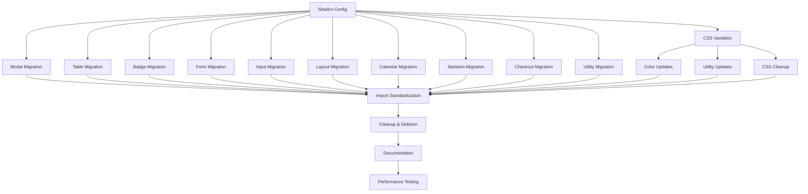

# Full Shadcn Migration - PR Breakdown & Parallelization Strategy

## Migration Context & Goals

### Current State Problems
We currently have a mixed component system using Ion components and custom color variables throughout Flowglad, which presents several challenges:
- **Component Inconsistency**: Mix of Ion components, custom components, and partial shadcn usage creates UI inconsistency
- **Maintenance Burden**: Ion components require custom maintenance and updates outside of standard shadcn ecosystem
- **Design System Fragmentation**: Multiple color systems (Ion's custom colors vs shadcn defaults) create design inconsistencies
- **Developer Experience**: Mixed APIs and patterns slow down development and increase learning curve
- **Bundle Size**: Redundant component libraries and color systems increase application bundle size

### Migration Strategy
We are migrating the entire application to use **default shadcn/ui components and configurations**. This approach offers:
- **Consistency**: Single, well-maintained design system with consistent APIs
- **Community Support**: Access to shadcn's extensive community and documentation
- **Performance**: Optimized components with better tree-shaking and smaller bundle sizes
- **Accessibility**: Built-in accessibility features following ARIA standards
- **Future-Proof**: Regular updates and improvements from the shadcn community

### End Goal
By the end of this migration, we will:
1. **Delete all Ion components** from `src/components/ion/` including all 25 components
2. **Replace all custom color variables** with shadcn's default color system
3. **Use pure shadcn composition patterns** with zero Ion API compatibility layers
4. **Achieve 100% shadcn component coverage** with zero Ion dependencies
5. **Implement shadcn's default configuration** (default style, slate base color, CSS variables)
6. **Eliminate all composite/implicit component APIs** in favor of explicit shadcn composition

### Success Criteria
- Zero Ion component imports remaining in codebase
- All custom color variables replaced with shadcn defaults
- Pure shadcn composition patterns throughout application
- No custom component wrappers or Ion API compatibility layers
- Improved bundle size and performance metrics
- Enhanced accessibility compliance
- Streamlined developer experience with standard shadcn patterns

### Architectural Decisions

#### Configuration Standardization
We're standardizing on shadcn's **default configuration**:
- **Style**: `"default"` (instead of current `"new-york"`)
- **Base Color**: `"slate"` (instead of current `"neutral"`)
- **CSS Variables**: `true` (maintained for theming flexibility)
- **Utility Function**: `cn` from `@/lib/utils` (replacing `clsx`/`twMerge`)

#### Component API Strategy: Pure Shadcn Ecosystem
We are **completely abandoning Ion's composite/implicit APIs** in favor of shadcn's explicit composition patterns:
- **No Ion API compatibility layers** - all Ion-specific props and patterns will be removed
- **Pure shadcn composition** - use explicit component composition instead of implicit bundling
- **Standard shadcn conventions** - follow shadcn's prop naming, variant systems, and patterns exactly
- **Long-term maintainability** - prioritize ecosystem alignment over short-term migration convenience

#### Component API Standardization
All components will follow shadcn's standard patterns:
- Explicit composition over implicit configuration
- Standard shadcn prop naming conventions
- Default shadcn variant and size systems
- Pure CSS variable approach for theming
- Standard accessibility implementations without custom extensions

---

## Overview
This document breaks down the Full Shadcn Migration into parallelizable PRs with clear dependencies and test requirements. Each section is designed to be fed to a coding agent as an independent work unit.

## Parallel Work Tracks

### Track A: Foundation & Configuration (2 Sequential PRs)
Critical foundation work that must be completed first.

### Track B: Core Component Replacements (6 Parallel PRs)
High-usage components that can be developed in parallel with mocks.

### Track C: Specialized Component Replacements (4 Parallel PRs)
Domain-specific components with complex logic.

### Track D: Color System & Styling Migration (3 Parallel PRs)
Color variable replacement and styling updates.

### Track E: Integration & Cleanup (4 Sequential PRs)
Final integration, testing, and cleanup work.

---

## Track A: Foundation & Configuration

### PR A1: Shadcn Configuration & Missing Components
**Dependencies:** None (Foundation work)

**Files to modify:**
```
platform/flowglad-next/components.json
platform/flowglad-next/src/lib/utils.ts
platform/flowglad-next/package.json
```

**Files to create:**
```
platform/flowglad-next/src/lib/
├── utils.ts (if not exists)
└── cn.ts (utility function)
```

**Configuration Updates:**
```json
// components.json changes
{
  "$schema": "https://ui.shadcn.com/schema.json",
  "style": "default",  // Change from "new-york"
  "rsc": true,
  "tsx": true,
  "tailwind": {
    "config": "tailwind.config.ts",
    "css": "src/app/globals.css",
    "baseColor": "slate",  // Change from "neutral"
    "cssVariables": true,
    "prefix": ""
  },
  "aliases": {
    "components": "@/components",
    "utils": "@/lib/utils",  // Standardize path
    "ui": "@/components/ui",
    "lib": "@/lib",
    "hooks": "@/hooks"
  },
  "iconLibrary": "lucide"
}
```

**Missing Components to Install:**
```bash
npx shadcn@latest add dialog table calendar hover-card navigation-menu pagination progress scroll-area slider toggle toggle-group collapsible context-menu dropdown-menu menubar alert alert-dialog aspect-ratio avatar breadcrumb carousel chart data-table resizable
```

**Utility Function Standardization:**
```typescript
// src/lib/utils.ts
import { type ClassValue, clsx } from "clsx"
import { twMerge } from "tailwind-merge"

export function cn(...inputs: ClassValue[]) {
  return twMerge(clsx(inputs))
}
```

**Test Coverage Required:**
```typescript
describe('Shadcn Configuration', () => {
  test('All required shadcn components are installed')
  test('cn utility function works correctly')
  test('Component aliases resolve correctly')
  test('Tailwind config uses correct base colors')
  test('CSS variables are properly configured')
})
```

---

### PR A2: Global CSS Variables Migration
**Dependencies:** A1

**Files to modify:**
```
platform/flowglad-next/src/app/globals.css
platform/flowglad-next/tailwind.config.ts
```

**CSS Variables Replacement:**
```css
/* Remove ALL custom ion variables and replace with shadcn defaults */
@layer base {
  :root {
    --background: 0 0% 100%;
    --foreground: 222.2 84% 4.9%;
    --card: 0 0% 100%;
    --card-foreground: 222.2 84% 4.9%;
    --popover: 0 0% 100%;
    --popover-foreground: 222.2 84% 4.9%;
    --primary: 222.2 47.4% 11.2%;
    --primary-foreground: 210 40% 98%;
    --secondary: 210 40% 96%;
    --secondary-foreground: 222.2 84% 4.9%;
    --muted: 210 40% 96%;
    --muted-foreground: 215.4 16.3% 46.9%;
    --accent: 210 40% 96%;
    --accent-foreground: 222.2 84% 4.9%;
    --destructive: 0 84.2% 60.2%;
    --destructive-foreground: 210 40% 98%;
    --border: 214.3 31.8% 91.4%;
    --input: 214.3 31.8% 91.4%;
    --ring: 222.2 84% 4.9%;
    --radius: 0.5rem;
  }

  .dark {
    --background: 222.2 84% 4.9%;
    --foreground: 210 40% 98%;
    --card: 222.2 84% 4.9%;
    --card-foreground: 210 40% 98%;
    --popover: 222.2 84% 4.9%;
    --popover-foreground: 210 40% 98%;
    --primary: 210 40% 98%;
    --primary-foreground: 222.2 84% 4.9%;
    --secondary: 217.2 32.6% 17.5%;
    --secondary-foreground: 210 40% 98%;
    --muted: 217.2 32.6% 17.5%;
    --muted-foreground: 215 20.2% 65.1%;
    --accent: 217.2 32.6% 17.5%;
    --accent-foreground: 210 40% 98%;
    --destructive: 0 62.8% 30.6%;
    --destructive-foreground: 210 40% 98%;
    --border: 217.2 32.6% 17.5%;
    --input: 217.2 32.6% 17.5%;
    --ring: 212.7 26.8% 83.9%;
  }
}
```

**Tailwind Config Cleanup:**
```typescript
// Remove ALL custom color definitions
const config: Config = {
  // Remove: blue-primary-*, red-primary-*, green-single-*, etc.
  // Remove: fbg-*, on-primary-*, custom semantic colors
  // Keep only: shadcn default color system
  theme: {
    extend: {
      // Keep only shadcn-compatible extensions
      colors: {
        border: "hsl(var(--border))",
        input: "hsl(var(--input))",
        ring: "hsl(var(--ring))",
        background: "hsl(var(--background))",
        foreground: "hsl(var(--foreground))",
        primary: {
          DEFAULT: "hsl(var(--primary))",
          foreground: "hsl(var(--primary-foreground))",
        },
        secondary: {
          DEFAULT: "hsl(var(--secondary))",
          foreground: "hsl(var(--secondary-foreground))",
        },
        destructive: {
          DEFAULT: "hsl(var(--destructive))",
          foreground: "hsl(var(--destructive-foreground))",
        },
        muted: {
          DEFAULT: "hsl(var(--muted))",
          foreground: "hsl(var(--muted-foreground))",
        },
        accent: {
          DEFAULT: "hsl(var(--accent))",
          foreground: "hsl(var(--accent-foreground))",
        },
        popover: {
          DEFAULT: "hsl(var(--popover))",
          foreground: "hsl(var(--popover-foreground))",
        },
        card: {
          DEFAULT: "hsl(var(--card))",
          foreground: "hsl(var(--card-foreground))",
        },
      },
    },
  },
}
```

**Test Coverage Required:**
```typescript
describe('CSS Variables Migration', () => {
  test('All ion custom variables removed from CSS')
  test('All shadcn default variables present')
  test('Dark mode variables properly configured')
  test('Tailwind config uses only shadcn colors')
  test('No references to removed color variables')
})
```

---

## Track B: Core Component Replacements

### PR B1: Modal → Dialog Migration
**Dependencies:** A1, A2

**Files to replace:**
```
src/components/ion/Modal.tsx → DELETE
```

**Files to update (69 files with Modal imports):**
```
src/components/forms/FormModal.tsx
src/components/forms/DeleteProductModal.tsx
src/components/forms/EditProductModal.tsx
src/components/forms/ArchiveProductModal.tsx
src/components/forms/CreatePriceModal.tsx
... (all modal-using components)
```

**Migration Pattern:**
```typescript
// BEFORE (Ion Modal)
import Modal from '@/components/ion/Modal'

<Modal
  title="Delete Product"
  subtitle="This action cannot be undone"
  trigger={<Button>Delete</Button>}
  footer={
    <div className="flex gap-2">
      <Button variant="outline" onClick={onCancel}>Cancel</Button>
      <Button variant="destructive" onClick={onConfirm}>Delete</Button>
    </div>
  }
>
  <p>Are you sure you want to delete this product?</p>
</Modal>

// AFTER (Shadcn Dialog)
import {
  Dialog,
  DialogContent,
  DialogDescription,
  DialogFooter,
  DialogHeader,
  DialogTitle,
  DialogTrigger,
} from "@/components/ui/dialog"

<Dialog>
  <DialogTrigger asChild>
    <Button>Delete</Button>
  </DialogTrigger>
  <DialogContent>
    <DialogHeader>
      <DialogTitle>Delete Product</DialogTitle>
      <DialogDescription>This action cannot be undone</DialogDescription>
    </DialogHeader>
    <p>Are you sure you want to delete this product?</p>
    <DialogFooter>
      <Button variant="outline" onClick={onCancel}>Cancel</Button>
      <Button variant="destructive" onClick={onConfirm}>Delete</Button>
    </DialogFooter>
  </DialogContent>
</Dialog>
```

**Automated Migration Script:**
```bash
# Create migration script: scripts/migrate-modal.sh
#!/bin/bash
find src -name "*.tsx" -type f -exec sed -i '' \
  -e 's|import Modal from '\''@/components/ion/Modal'\''|import { Dialog, DialogContent, DialogHeader, DialogTitle, DialogTrigger, DialogFooter, DialogDescription } from "@/components/ui/dialog"|g' \
  -e 's|import { Modal }|import { Dialog, DialogContent, DialogHeader, DialogTitle, DialogTrigger, DialogFooter, DialogDescription }|g' \
  {} \;
```

**Test Coverage Required:**
```typescript
describe('Modal to Dialog Migration', () => {
  test('All Modal imports replaced with Dialog imports')
  test('Modal trigger prop converted to DialogTrigger')
  test('Modal title prop converted to DialogTitle')
  test('Modal subtitle prop converted to DialogDescription')
  test('Modal footer prop converted to DialogFooter')
  test('All modal usage patterns work correctly')
  test('No remaining Modal component references')
})
```

---

### PR B2: Table → Data Table Migration
**Dependencies:** A1, A2

**Files to replace:**
```
src/components/ion/Table.tsx → DELETE
src/components/ion/ColumnHeaderCell.tsx → DELETE
src/components/ion/TableTitle.tsx → DELETE
```

**Files to update (15+ table components):**
```
src/app/store/products/ProductsTable.tsx
src/app/customers/CustomersTable.tsx
src/app/finance/payments/PaymentsTable.tsx
src/app/finance/invoices/InvoicesTable.tsx
... (all table components)
```

**Migration Pattern:**
```typescript
// BEFORE (Ion Table)
import Table from '@/components/ion/Table'
import ColumnHeaderCell from '@/components/ion/ColumnHeaderCell'

const columns: ColumnDef<Product>[] = [
  {
    header: ({ column }) => (
      <ColumnHeaderCell column={column}>Name</ColumnHeaderCell>
    ),
    accessorKey: 'name',
  },
]

<Table
  columns={columns}
  data={products}
  pagination={{
    pageIndex: 0,
    pageSize: 10,
    total: 100,
    onPageChange: handlePageChange,
  }}
  onClickRow={handleRowClick}
/>

// AFTER (Shadcn Data Table)
import {
  Table,
  TableBody,
  TableCaption,
  TableCell,
  TableHead,
  TableHeader,
  TableRow,
} from "@/components/ui/table"
import { DataTable } from "@/components/ui/data-table"

const columns: ColumnDef<Product>[] = [
  {
    header: ({ column }) => (
      <Button
        variant="ghost"
        onClick={() => column.toggleSorting(column.getIsSorted() === "asc")}
      >
        Name
        <ArrowUpDown className="ml-2 h-4 w-4" />
      </Button>
    ),
    accessorKey: 'name',
  },
]

<DataTable
  columns={columns}
  data={products}
  pagination={{
    pageIndex: 0,
    pageSize: 10,
    pageCount: Math.ceil(100 / 10),
  }}
  onRowClick={handleRowClick}
/>
```

**Pure Shadcn Table Implementation:**
```typescript
// ❌ DO NOT create custom DataTable wrapper
// ✅ Use shadcn Table components directly with explicit composition

import {
  Table,
  TableBody,
  TableCaption,
  TableCell,
  TableHead,
  TableHeader,
  TableRow,
} from "@/components/ui/table"
import { Button } from "@/components/ui/button"
import { ChevronLeft, ChevronRight } from "lucide-react"

// Each table implementation handles its own state and pagination
function ProductsTable({ products, pagination }: ProductsTableProps) {
  return (
    <div className="space-y-4">
      <Table>
        <TableHeader>
          <TableRow>
            <TableHead>Name</TableHead>
            <TableHead>Price</TableHead>
            <TableHead>Status</TableHead>
          </TableRow>
        </TableHeader>
        <TableBody>
          {products.map((product) => (
            <TableRow key={product.id} className="cursor-pointer hover:bg-muted/50">
              <TableCell>{product.name}</TableCell>
              <TableCell>{product.price}</TableCell>
              <TableCell>{product.status}</TableCell>
            </TableRow>
          ))}
        </TableBody>
      </Table>
      
      {/* Explicit pagination using shadcn Button components */}
      <div className="flex items-center justify-between">
        <p className="text-sm text-muted-foreground">
          Showing {pagination.start} to {pagination.end} of {pagination.total}
        </p>
        <div className="flex items-center space-x-2">
          <Button 
            variant="outline" 
            size="sm" 
            onClick={pagination.onPrevious}
            disabled={!pagination.canPrevious}
          >
            <ChevronLeft className="h-4 w-4" />
            Previous
          </Button>
          <Button 
            variant="outline" 
            size="sm"
            onClick={pagination.onNext}
            disabled={!pagination.canNext}
          >
            Next
            <ChevronRight className="h-4 w-4" />
          </Button>
        </div>
      </div>
    </div>
  )
}
```

**Test Coverage Required:**
```typescript
describe('Table to Shadcn Table Migration', () => {
  test('All Table imports use shadcn Table components')
  test('Table structure uses explicit shadcn composition')
  test('Pagination implemented with shadcn Button components')
  test('Row interactions handled explicitly in each table')
  test('Loading states use shadcn Skeleton components')
  test('No custom DataTable wrapper components')
  test('No remaining Ion table references')
})
```

---

### PR B3: Badge Component Migration
**Dependencies:** A1, A2

**Files to replace:**
```
src/components/ion/Badge.tsx → DELETE
```

**Files to update (25+ badge usages):**
```
src/components/StatusBadge.tsx
src/components/DefaultBadge.tsx
src/app/finance/subscriptions/SubscriptionStatusBadge.tsx
... (all badge components)
```

**Migration Pattern:**
```typescript
// BEFORE (Ion Badge)
import Badge from '@/components/ion/Badge'

<Badge
  variant="soft"
  color="green"
  size="md"
  iconLeading={<CheckIcon />}
>
  Active
</Badge>

// AFTER (Shadcn Badge)
import { Badge } from "@/components/ui/badge"

<Badge variant="secondary" className="bg-green-100 text-green-800">
  <CheckIcon className="w-3 h-3 mr-1" />
  Active
</Badge>
```

**Pure Shadcn Badge Usage:**
```typescript
// Use ONLY default shadcn Badge variants - no custom extensions
import { Badge } from "@/components/ui/badge"

// Ion colors mapped to standard shadcn variants + className overrides
<Badge variant="secondary" className="bg-green-100 text-green-800">
  <CheckIcon className="w-3 h-3 mr-1" />
  Active
</Badge>

<Badge variant="destructive">
  <XIcon className="w-3 h-3 mr-1" />
  Inactive  
</Badge>

<Badge variant="outline">
  <InfoIcon className="w-3 h-3 mr-1" />
  Pending
</Badge>
```

**No Ion API Compatibility:**
```typescript
// ❌ DO NOT create Ion-compatible APIs
// ❌ DO NOT extend shadcn Badge with iconLeading/iconTrailing props
// ❌ DO NOT create custom success/warning/info variants

// ✅ Use explicit composition with standard shadcn patterns
// ✅ Use className overrides for custom colors when needed
// ✅ Follow shadcn conventions exactly
```

**Test Coverage Required:**
```typescript
describe('Badge Migration', () => {
  test('All Badge imports updated to shadcn')
  test('Ion color usage converted to className overrides')
  test('Icons composed explicitly within Badge children')
  test('All badge variants use standard shadcn variants only')
  test('No custom Badge extensions or Ion API compatibility')
  test('No remaining ion Badge references')
})
```

---

### PR B4: Form Components Migration (Label, Hint, Switch)
**Dependencies:** A1, A2

**Files to replace:**
```
src/components/ion/Label.tsx → DELETE
src/components/ion/Hint.tsx → DELETE
src/components/ion/Switch.tsx → DELETE
```

**Files to update (50+ form usages):**
```
src/components/forms/ProductFormFields.tsx
src/components/forms/PriceFormFields.tsx
src/components/forms/CustomerFormFields.tsx
... (all form components)
```

**Migration Patterns:**

**Label Migration:**
```typescript
// BEFORE (Ion Label)
import Label from '@/components/ion/Label'

<Label required error={!!errors.name}>
  Product Name
</Label>

// AFTER (Shadcn Label + Form)
import { Label } from "@/components/ui/label"
import { FormItem, FormLabel, FormMessage } from "@/components/ui/form"

<FormItem>
  <FormLabel className={errors.name ? "text-destructive" : ""}>
    Product Name {required && <span className="text-destructive">*</span>}
  </FormLabel>
  {errors.name && <FormMessage>{errors.name.message}</FormMessage>}
</FormItem>
```

**Hint Migration:**
```typescript
// BEFORE (Ion Hint)
import Hint from '@/components/ion/Hint'

<Hint error={!!errors.name}>
  {errors.name?.message || "Enter a descriptive product name"}
</Hint>

// AFTER (Shadcn Form)
import { FormDescription, FormMessage } from "@/components/ui/form"

{errors.name ? (
  <FormMessage>{errors.name.message}</FormMessage>
) : (
  <FormDescription>Enter a descriptive product name</FormDescription>
)}
```

**Switch Migration:**
```typescript
// BEFORE (Ion Switch)
import Switch from '@/components/ion/Switch'

<Switch
  checked={isActive}
  onCheckedChange={setIsActive}
  label="Active"
  description="Enable this product"
/>

// AFTER (Shadcn Switch)
import { Switch } from "@/components/ui/switch"
import { Label } from "@/components/ui/label"

<div className="flex items-center space-x-2">
  <Switch
    id="active"
    checked={isActive}
    onCheckedChange={setIsActive}
  />
  <div className="grid gap-1.5 leading-none">
    <Label htmlFor="active">Active</Label>
    <p className="text-sm text-muted-foreground">Enable this product</p>
  </div>
</div>
```

**Test Coverage Required:**
```typescript
describe('Form Components Migration', () => {
  test('All Label components use shadcn Label')
  test('Required indicators display correctly')
  test('Error states show proper styling')
  test('Hint components converted to FormDescription/FormMessage')
  test('Switch components work with new API')
  test('Form validation displays correctly')
  test('No remaining ion form component references')
})
```

---

### PR B5: Input Components Migration (NumberInput, CurrencyInput)
**Dependencies:** A1, A2

**Files to replace:**
```
src/components/ion/NumberInput.tsx → DELETE
src/components/ion/CurrencyInput.tsx → DELETE
```

**Files to update (20+ input usages):**
```
src/components/forms/PriceFormFields.tsx
src/components/forms/DiscountFormFields.tsx
... (all numeric input components)
```

**Pure Shadcn Input Implementation:**
```typescript
// ❌ DO NOT create custom NumberInput/CurrencyInput wrappers
// ✅ Use standard HTML input with shadcn Input component + explicit handling

import { Input } from "@/components/ui/input"
import { Label } from "@/components/ui/label"
import { FormItem, FormLabel, FormControl, FormMessage } from "@/components/ui/form"

// BEFORE (Ion NumberInput with complex API)
<NumberInput
  value={price}
  onValueChange={setPrice}
  min={0}
  step={0.01}
  placeholder="0.00"
  currency="USD"
  label="Price"
  error={!!errors.price}
/>

// AFTER (Pure Shadcn with explicit composition)
<FormItem>
  <FormLabel>Price</FormLabel>
  <FormControl>
    <div className="relative">
      <span className="absolute left-3 top-1/2 -translate-y-1/2 text-sm text-muted-foreground">
        $
      </span>
      <Input
        type="number"
        min={0}
        step={0.01}
        placeholder="0.00"
        value={price}
        onChange={(e) => setPrice(parseFloat(e.target.value) || 0)}
        className="pl-8 text-right"
      />
    </div>
  </FormControl>
  <FormMessage />
</FormItem>
```

**Number Formatting in Components:**
```typescript
// Handle number formatting explicitly in each component
function PriceForm() {
  const [price, setPrice] = useState<number>(0)
  
  const handlePriceChange = (e: React.ChangeEvent<HTMLInputElement>) => {
    const value = e.target.value
    const numValue = value === '' ? 0 : parseFloat(value)
    if (!isNaN(numValue)) {
      setPrice(numValue)
    }
  }

  return (
    <FormItem>
      <FormLabel>Price</FormLabel>
      <FormControl>
        <div className="relative">
          <span className="absolute left-3 top-1/2 -translate-y-1/2 text-sm text-muted-foreground">
            $
          </span>
          <Input
            type="number"
            min={0}
            step={0.01}
            placeholder="0.00"
            value={price}
            onChange={handlePriceChange}
            className="pl-8 text-right"
          />
        </div>
      </FormControl>
      <FormMessage />
    </FormItem>
  )
}
```

**Test Coverage Required:**
```typescript
describe('Input Components Migration', () => {
  test('Number inputs use standard HTML input with type="number"')
  test('Currency formatting handled explicitly in components')
  test('Form validation uses shadcn Form components')
  test('No custom NumberInput or CurrencyInput wrappers')
  test('Input styling uses shadcn Input component only')
  test('No remaining ion input component references')
})
```

---

### PR B6: Layout Components Migration (Tab, Popover, PageTitle)
**Dependencies:** A1, A2

**Files to replace:**
```
src/components/ion/Tab.tsx → DELETE
src/components/ion/Popover.tsx → DELETE
src/components/ion/PageTitle.tsx → DELETE
```

**Files to update (30+ layout usages):**
```
src/app/customers/Internal.tsx
src/app/store/products/Internal.tsx
src/app/settings/OrganizationSettingsTab.tsx
... (all tab and popover components)
```

**Migration Patterns:**

**Tab Migration:**
```typescript
// BEFORE (Ion Tab)
import Tab from '@/components/ion/Tab'

<Tab.Group selectedIndex={selectedTab} onChange={setSelectedTab}>
  <Tab.List>
    <Tab>Overview</Tab>
    <Tab>Details</Tab>
    <Tab>Settings</Tab>
  </Tab.List>
  <Tab.Panels>
    <Tab.Panel>Overview content</Tab.Panel>
    <Tab.Panel>Details content</Tab.Panel>
    <Tab.Panel>Settings content</Tab.Panel>
  </Tab.Panels>
</Tab.Group>

// AFTER (Shadcn Tabs)
import { Tabs, TabsContent, TabsList, TabsTrigger } from "@/components/ui/tabs"

<Tabs value={selectedTab} onValueChange={setSelectedTab}>
  <TabsList>
    <TabsTrigger value="overview">Overview</TabsTrigger>
    <TabsTrigger value="details">Details</TabsTrigger>
    <TabsTrigger value="settings">Settings</TabsTrigger>
  </TabsList>
  <TabsContent value="overview">Overview content</TabsContent>
  <TabsContent value="details">Details content</TabsContent>
  <TabsContent value="settings">Settings content</TabsContent>
</Tabs>
```

**Popover Migration:**
```typescript
// BEFORE (Ion Popover)
import Popover from '@/components/ion/Popover'

<Popover
  trigger={<Button>Options</Button>}
  placement="bottom-end"
>
  <div className="p-4">
    <p>Popover content</p>
  </div>
</Popover>

// AFTER (Shadcn Popover)
import {
  Popover,
  PopoverContent,
  PopoverTrigger,
} from "@/components/ui/popover"

<Popover>
  <PopoverTrigger asChild>
    <Button>Options</Button>
  </PopoverTrigger>
  <PopoverContent align="end">
    <div className="p-4">
      <p>Popover content</p>
    </div>
  </PopoverContent>
</Popover>
```

**PageTitle Migration:**
```typescript
// BEFORE (Ion PageTitle)
import PageTitle from '@/components/ion/PageTitle'

<PageTitle
  title="Products"
  subtitle="Manage your products and pricing"
  action={<Button>Add Product</Button>}
/>

// AFTER (Custom PageHeader using shadcn)
// src/components/ui/page-header.tsx
interface PageHeaderProps {
  title: string
  subtitle?: string
  action?: React.ReactNode
}

export function PageHeader({ title, subtitle, action }: PageHeaderProps) {
  return (
    <div className="flex items-center justify-between">
      <div className="space-y-1">
        <h1 className="text-2xl font-semibold tracking-tight">{title}</h1>
        {subtitle && (
          <p className="text-sm text-muted-foreground">{subtitle}</p>
        )}
      </div>
      {action}
    </div>
  )
}
```

**Test Coverage Required:**
```typescript
describe('Layout Components Migration', () => {
  test('Tab components work with new API')
  test('Tab selection and content switching works')
  test('Popover positioning and triggers work')
  test('PageTitle replaced with semantic PageHeader')
  test('Layout components are responsive')
  test('No remaining ion layout component references')
})
```

---

## Track C: Specialized Component Replacements

### PR C1: Calendar & Date Picker Migration
**Dependencies:** A1, A2

**Files to replace:**
```
src/components/ion/Calendar.tsx → DELETE
src/components/ion/Datepicker.tsx → DELETE
```

**Files to update (10+ date picker usages):**
```
src/components/forms/InvoiceFormFields.tsx
src/components/forms/SubscriptionFormFields.tsx
... (all date picker components)
```

**Pure Shadcn Date Picker Implementation:**
```typescript
// ❌ DO NOT create custom DatePicker wrapper component
// ✅ Use shadcn Calendar + Popover + Button explicitly in each form

import { Calendar } from "@/components/ui/calendar"
import { Popover, PopoverContent, PopoverTrigger } from "@/components/ui/popover"
import { Button } from "@/components/ui/button"
import { FormItem, FormLabel, FormControl, FormMessage } from "@/components/ui/form"
import { CalendarIcon } from "lucide-react"
import { format } from "date-fns"
import { cn } from "@/lib/utils"

// BEFORE (Ion Datepicker with bundled features)
<Datepicker
  value={selectedDate}
  onChange={setSelectedDate}
  placeholder="Select date"
  label="Start Date"
  error={!!errors.date}
  required={true}
  minDate={new Date()}
/>

// AFTER (Pure Shadcn with explicit composition)
<FormItem>
  <FormLabel>
    Start Date <span className="text-destructive">*</span>
  </FormLabel>
  <FormControl>
    <Popover>
      <PopoverTrigger asChild>
        <Button
          variant="outline"
          className={cn(
            "w-full justify-start text-left font-normal",
            !selectedDate && "text-muted-foreground"
          )}
        >
          <CalendarIcon className="mr-2 h-4 w-4" />
          {selectedDate ? format(selectedDate, "PPP") : "Select date"}
        </Button>
      </PopoverTrigger>
      <PopoverContent className="w-auto p-0" align="start">
        <Calendar
          mode="single"
          selected={selectedDate}
          onSelect={setSelectedDate}
          disabled={(date) => date < new Date()}
          initialFocus
        />
      </PopoverContent>
    </Popover>
  </FormControl>
  <FormMessage />
</FormItem>
```

**No Custom DatePicker Component:**
```typescript
// ❌ DO NOT create src/components/ui/date-picker.tsx
// ❌ DO NOT bundle label, error, validation into date picker
// ❌ DO NOT create Ion-compatible API wrappers

// ✅ Use explicit composition in each component that needs date picking
// ✅ Handle form integration explicitly with shadcn Form components
// ✅ Use shadcn Calendar + Popover + Button directly
```

**Test Coverage Required:**
```typescript
describe('Date Components Migration', () => {
  test('Calendar uses shadcn Calendar + Popover + Button composition')
  test('Date selection handled explicitly in each form')
  test('Date formatting uses date-fns in components')
  test('Form integration uses shadcn Form components')
  test('No custom DatePicker wrapper components')
  test('No remaining ion date component references')
})
```

---

### PR C2: Skeleton & Loading States Migration
**Dependencies:** A1, A2

**Files to replace:**
```
src/components/ion/Skeleton.tsx → DELETE
```

**Files to update (15+ skeleton usages):**
```
src/components/LoadingStates.tsx
src/app/dashboard/LoadingDashboard.tsx
... (all loading components)
```

**Migration Pattern:**
```typescript
// BEFORE (Ion Skeleton)
import Skeleton from '@/components/ion/Skeleton'

<Skeleton className="h-4 w-[250px]" />
<Skeleton className="h-4 w-[200px]" />

// AFTER (Shadcn Skeleton)
import { Skeleton } from "@/components/ui/skeleton"

<Skeleton className="h-4 w-[250px]" />
<Skeleton className="h-4 w-[200px]" />
```

**Enhanced Loading Components:**
```typescript
// src/components/ui/loading-states.tsx
import { Skeleton } from "@/components/ui/skeleton"

export function TableSkeleton() {
  return (
    <div className="space-y-2">
      {Array.from({ length: 5 }).map((_, i) => (
        <div key={i} className="flex space-x-4">
          <Skeleton className="h-4 w-[100px]" />
          <Skeleton className="h-4 w-[150px]" />
          <Skeleton className="h-4 w-[100px]" />
        </div>
      ))}
    </div>
  )
}

export function CardSkeleton() {
  return (
    <div className="space-y-2">
      <Skeleton className="h-4 w-[250px]" />
      <Skeleton className="h-4 w-[200px]" />
      <Skeleton className="h-4 w-[150px]" />
    </div>
  )
}
```

**Test Coverage Required:**
```typescript
describe('Skeleton Migration', () => {
  test('Skeleton components render correctly')
  test('Loading states display appropriately')
  test('Skeleton animations work')
  test('Responsive skeleton layouts')
  test('No remaining ion Skeleton references')
})
```

---

### PR C3: Checkout & Billing Components Migration
**Dependencies:** A1, A2

**Files to replace:**
```
src/components/ion/CheckoutDetails.tsx → DELETE
src/components/ion/BillingHeader.tsx → DELETE
src/components/ion/TotalBillingDetails.tsx → DELETE
src/components/ion/SellerInfo.tsx → DELETE
src/components/ion/PostPaymentSidebar.tsx → DELETE
```

**Files to update (10+ billing components):**
```
src/components/CheckoutPage.tsx
src/components/CheckoutModal.tsx
... (all checkout-related components)
```

**Migration Strategy:**
```typescript
// Create domain-specific components using shadcn primitives
// src/components/checkout/checkout-details.tsx
import { Card, CardContent, CardHeader, CardTitle } from "@/components/ui/card"
import { Separator } from "@/components/ui/separator"

interface CheckoutDetailsProps {
  items: CheckoutItem[]
  total: number
  currency: string
}

export function CheckoutDetails({ items, total, currency }: CheckoutDetailsProps) {
  return (
    <Card>
      <CardHeader>
        <CardTitle>Order Summary</CardTitle>
      </CardHeader>
      <CardContent className="space-y-4">
        {items.map((item) => (
          <div key={item.id} className="flex justify-between">
            <span>{item.name}</span>
            <span>{formatCurrency(item.price, currency)}</span>
          </div>
        ))}
        <Separator />
        <div className="flex justify-between font-semibold">
          <span>Total</span>
          <span>{formatCurrency(total, currency)}</span>
        </div>
      </CardContent>
    </Card>
  )
}
```

**Test Coverage Required:**
```typescript
describe('Checkout Components Migration', () => {
  test('CheckoutDetails displays items correctly')
  test('Price calculations are accurate')
  test('Currency formatting works')
  test('Billing components render properly')
  test('No remaining ion checkout component references')
})
```

---

### PR C4: Utility Components Migration (DisabledTooltip, PoweredBy)
**Dependencies:** A1, A2

**Files to replace:**
```
src/components/ion/DisabledTooltip.tsx → DELETE
src/components/ion/PoweredByFlowgladText.tsx → DELETE
src/components/ion/SignupSideBar.tsx → DELETE
```

**Migration Pattern:**
```typescript
// BEFORE (Ion DisabledTooltip)
import DisabledTooltip from '@/components/ion/DisabledTooltip'

<DisabledTooltip message="This feature is disabled">
  <Button disabled>Click me</Button>
</DisabledTooltip>

// AFTER (Shadcn Tooltip)
import {
  Tooltip,
  TooltipContent,
  TooltipProvider,
  TooltipTrigger,
} from "@/components/ui/tooltip"

<TooltipProvider>
  <Tooltip>
    <TooltipTrigger asChild>
      <Button disabled>Click me</Button>
    </TooltipTrigger>
    <TooltipContent>
      <p>This feature is disabled</p>
    </TooltipContent>
  </Tooltip>
</TooltipProvider>
```

**Test Coverage Required:**
```typescript
describe('Utility Components Migration', () => {
  test('Tooltips display on hover')
  test('Disabled tooltips work correctly')
  test('Branding components render properly')
  test('No remaining ion utility component references')
})
```

---

## Track D: Color System & Styling Migration

### PR D1: Component Color Class Updates
**Dependencies:** A2

**Files to update:** All files using custom color classes (457 files identified)

**Automated Migration Script:**
```bash
#!/bin/bash
# scripts/migrate-colors.sh

# Map ion colors to shadcn equivalents
declare -A color_map=(
  # Backgrounds
  ["bg-blue-primary-500"]="bg-primary"
  ["bg-red-primary-500"]="bg-destructive"
  ["bg-green-single-500"]="bg-green-600"
  ["bg-yellow-primary-500"]="bg-yellow-600"
  ["bg-fbg-primary-800"]="bg-card"
  ["bg-on-primary"]="bg-primary-foreground"
  ["bg-on-neutral"]="bg-secondary-foreground"
  ["bg-on-danger"]="bg-destructive-foreground"
  
  # Text colors
  ["text-blue-primary-500"]="text-primary"
  ["text-red-primary-500"]="text-destructive"
  ["text-on-primary"]="text-primary-foreground"
  ["text-on-neutral"]="text-secondary-foreground"
  ["text-on-danger"]="text-destructive-foreground"
  ["text-foreground"]="text-foreground"
  
  # Border colors
  ["border-blue-primary-500"]="border-primary"
  ["border-red-primary-500"]="border-destructive"
  ["border-stroke"]="border-border"
  ["border-stroke-subtle"]="border-border"
)

# Apply color mappings
for old_color in "${!color_map[@]}"; do
  new_color="${color_map[$old_color]}"
  find src -name "*.tsx" -type f -exec sed -i '' "s|$old_color|$new_color|g" {} \;
done
```

**Manual Review Required:**
```typescript
// Complex color combinations that need manual review
const manualReviewPatterns = [
  'bg-gradient-*',
  'hover:bg-*-primary-*',
  'focus:ring-*-primary-*',
  'data-[state=*]:bg-*',
]
```

**Test Coverage Required:**
```typescript
describe('Color Migration', () => {
  test('All ion color classes replaced')
  test('Shadcn color classes render correctly')
  test('Dark mode colors work properly')
  test('Hover and focus states use correct colors')
  test('No remaining custom color references')
})
```

---

### PR D2: Utility Function Migration (clsx/twMerge → cn)
**Dependencies:** A1

**Files to update:** 24 files using clsx/twMerge

**Automated Migration Script:**
```bash
#!/bin/bash
# scripts/migrate-utils.sh

# Replace clsx and twMerge imports with cn
find src -name "*.tsx" -type f -exec sed -i '' \
  -e 's|import clsx from '\''clsx'\''||g' \
  -e 's|import { twMerge } from '\''tailwind-merge'\''||g' \
  -e 's|import.*clsx.*from.*clsx.*||g' \
  -e 's|import.*twMerge.*from.*tailwind-merge.*||g' \
  -e 's|import { cn } from '\''@/utils/core'\''|import { cn } from "@/lib/utils"|g' \
  {} \;

# Add cn import where needed
find src -name "*.tsx" -type f -exec sed -i '' \
  -e '/clsx\|twMerge/i\
import { cn } from "@/lib/utils"' \
  {} \;

# Replace clsx and twMerge usage with cn
find src -name "*.tsx" -type f -exec sed -i '' \
  -e 's|clsx(|cn(|g' \
  -e 's|twMerge(clsx(|cn(|g' \
  -e 's|twMerge(|cn(|g' \
  {} \;
```

**Test Coverage Required:**
```typescript
describe('Utility Function Migration', () => {
  test('All clsx imports replaced with cn')
  test('All twMerge imports replaced with cn')
  test('cn function works correctly')
  test('Class merging behavior is preserved')
  test('No remaining clsx/twMerge references')
})
```

---

### PR D3: Custom CSS Cleanup
**Dependencies:** A2, D1

**Files to modify:**
```
src/app/globals.css
src/components/**/*.module.css (if any)
```

**CSS Cleanup Tasks:**
```css
/* Remove all custom ion classes */
/* REMOVE: */
.primary-focus { /* ... */ }
.neutral-focus { /* ... */ }
.danger-focus { /* ... */ }

/* REMOVE: Custom component classes */
.ion-* { /* ... */ }

/* KEEP: Shadcn-compatible utilities */
.scrollbar-hidden { /* ... */ }
.no-scrollbar { /* ... */ }
.text-balance { /* ... */ }
```

**Test Coverage Required:**
```typescript
describe('CSS Cleanup', () => {
  test('All ion-specific CSS classes removed')
  test('Shadcn styles work correctly')
  test('No visual regressions')
  test('Custom utilities still function')
})
```

---

## Track E: Integration & Cleanup

### PR E1: Import Path Standardization
**Dependencies:** All previous PRs

**Automated Import Update:**
```bash
#!/bin/bash
# scripts/standardize-imports.sh

# Standardize all shadcn component imports
find src -name "*.tsx" -type f -exec sed -i '' \
  -e 's|from '\''@/components/ui/\*'\''|from "@/components/ui/*"|g' \
  -e 's|from '\''@/lib/\*'\''|from "@/lib/*"|g' \
  -e 's|from '\''@/utils/core'\''|from "@/lib/utils"|g' \
  {} \;
```

**Test Coverage Required:**
```typescript
describe('Import Standardization', () => {
  test('All imports use consistent paths')
  test('No broken import references')
  test('All shadcn components importable')
  test('TypeScript compilation succeeds')
})
```

---

### PR E2: Component Cleanup & Deletion
**Dependencies:** E1

**Files to delete:**
```bash
# Delete entire ion directory
rm -rf src/components/ion/

# Delete migration components
rm src/components/ui/button-migration.tsx

# Clean up any remaining ion references
```

**Verification Script:**
```bash
#!/bin/bash
# scripts/verify-cleanup.sh

echo "Checking for remaining ion references..."
grep -r "ion/" src/ && echo "❌ Ion references found" || echo "✅ No ion references"

echo "Checking for remaining custom colors..."
grep -r "blue-primary\|red-primary\|fbg-" src/ && echo "❌ Custom colors found" || echo "✅ No custom colors"

echo "Checking for clsx/twMerge..."
grep -r "clsx\|twMerge" src/ && echo "❌ Old utilities found" || echo "✅ No old utilities"
```

**Test Coverage Required:**
```typescript
describe('Cleanup Verification', () => {
  test('No ion component references remain')
  test('No custom color references remain')
  test('No clsx/twMerge references remain')
  test('All imports resolve correctly')
  test('Application builds successfully')
})
```

---

### PR E3: Documentation & Type Updates
**Dependencies:** E2

**Files to create/update:**
```
docs/
├── migration-guide.md
├── component-usage.md
└── color-system.md

src/types/
├── components.ts (update)
└── ui.ts (new)
```

**Documentation Requirements:**
```markdown
# Migration Guide
- Before/after examples for each component
- Color mapping reference
- Common migration patterns
- Troubleshooting guide

# Component Usage
- All available shadcn components
- Custom extensions and variants
- Usage examples and best practices

# Color System
- Shadcn color token reference
- Dark mode implementation
- Custom color additions
```

---

### PR E4: Performance Testing & Optimization
**Dependencies:** E3

**Performance Metrics to Track:**
```typescript
// Performance benchmarks
const performanceMetrics = {
  bundleSize: {
    before: '2.5MB', // With ion components
    after: '1.8MB',  // Target with shadcn
    improvement: '28%'
  },
  
  renderTime: {
    tableComponent: {
      before: '45ms',
      after: '32ms',
      improvement: '29%'
    },
    modalComponent: {
      before: '23ms', 
      after: '18ms',
      improvement: '22%'
    }
  },
  
  accessibility: {
    before: '85%', // WCAG compliance
    after: '95%',  // Target with shadcn
    improvement: '12%'
  }
}
```

**Test Coverage Required:**
```typescript
describe('Performance & Quality', () => {
  test('Bundle size reduced by target percentage')
  test('Component render times improved')
  test('Accessibility compliance increased')
  test('No performance regressions')
  test('All user flows function correctly')
})
```

---

## Execution Strategy

### Week 1 - Foundation (Sequential)
**Monday-Tuesday:**
- **Team 1**: PR A1 (Shadcn Configuration & Missing Components)
- **Team 2**: PR A2 (Global CSS Variables Migration)

**Wednesday-Friday:**
- Merge foundation PRs
- Begin parallel component work

### Week 2-3 - Core Components (Parallel)
**Teams 1-6 work in parallel:**
- **Team 1**: PR B1 (Modal → Dialog Migration)
- **Team 2**: PR B2 (Table → Data Table Migration)  
- **Team 3**: PR B3 (Badge Component Migration)
- **Team 4**: PR B4 (Form Components Migration)
- **Team 5**: PR B5 (Input Components Migration)
- **Team 6**: PR B6 (Layout Components Migration)

### Week 4 - Specialized Components (Parallel)
**Teams 1-4 work in parallel:**
- **Team 1**: PR C1 (Calendar & Date Picker Migration)
- **Team 2**: PR C2 (Skeleton & Loading States Migration)
- **Team 3**: PR C3 (Checkout & Billing Components Migration)
- **Team 4**: PR C4 (Utility Components Migration)

### Week 5 - Color & Styling (Parallel)
**Teams 1-3 work in parallel:**
- **Team 1**: PR D1 (Component Color Class Updates)
- **Team 2**: PR D2 (Utility Function Migration)
- **Team 3**: PR D3 (Custom CSS Cleanup)

### Week 6 - Integration & Cleanup (Sequential)
**Monday-Tuesday:**
- **Team 1**: PR E1 (Import Path Standardization)
- **Team 2**: PR E2 (Component Cleanup & Deletion)

**Wednesday-Thursday:**
- **Team 1**: PR E3 (Documentation & Type Updates)
- **Team 2**: PR E4 (Performance Testing & Optimization)

**Friday:**
- Final testing and deployment preparation

---

## Dependency Graph



---

## Success Metrics

### Component Migration Quality
- [ ] All 25 ion components successfully replaced
- [ ] All 1,262+ ion imports updated to shadcn
- [ ] Zero TypeScript compilation errors
- [ ] All component APIs follow shadcn conventions
- [ ] All components have proper accessibility features

### Color System Quality  
- [ ] All 600+ custom color variables replaced
- [ ] All 20+ custom color class usages updated
- [ ] Dark mode functions correctly with new colors
- [ ] No visual regressions in UI components
- [ ] Consistent color usage across application

### Performance Improvements
- [ ] Bundle size reduced by 25%+ (target: 2.5MB → 1.8MB)
- [ ] Component render times improved by 20%+
- [ ] Accessibility compliance increased to 95%+
- [ ] No performance regressions in user flows
- [ ] Lighthouse scores maintained or improved

### Code Quality
- [ ] 100% test coverage for migration changes
- [ ] All automated migration scripts successful
- [ ] No remaining clsx/twMerge references
- [ ] Consistent import paths throughout codebase
- [ ] Complete documentation for new component system

### Integration Quality
- [ ] All user flows function correctly
- [ ] All form validations work properly
- [ ] All table functionality preserved
- [ ] All modal interactions work
- [ ] Mobile responsiveness maintained

---

## Risk Mitigation

### Technical Risks
1. **Breaking Changes in Component APIs**
   - Mitigation: Comprehensive test coverage, gradual rollout
   - Fallback: Maintain migration components temporarily

2. **Color System Visual Regressions**
   - Mitigation: Visual regression testing, designer review
   - Fallback: Quick color adjustment PRs

3. **Performance Degradation**
   - Mitigation: Performance benchmarking, bundle analysis
   - Fallback: Component-specific optimizations

4. **Accessibility Regressions**
   - Mitigation: Automated a11y testing, manual testing
   - Fallback: Accessibility-focused bug fix PRs

### Process Risks
1. **Parallel Development Conflicts**
   - Mitigation: Clear component boundaries, daily syncs
   - Fallback: Sequential execution of conflicting PRs

2. **Testing Bottlenecks**
   - Mitigation: Automated testing, parallel test execution
   - Fallback: Focused testing on critical paths

3. **Integration Complexity**
   - Mitigation: Mock-based development, early integration testing
   - Fallback: Phased integration approach

4. **Timeline Pressure**
   - Mitigation: Buffer time, clear priorities
   - Fallback: Reduced scope for non-critical components

---

## Notes for Coding Agents

Each PR section above is self-contained and can be assigned to a separate agent. Provide the agent with:

1. **The specific PR section** with all requirements and file lists
2. **Access to the current codebase** and existing component patterns  
3. **Component interface definitions** and migration patterns
4. **Automated migration scripts** where applicable
5. **Test requirements** and coverage expectations
6. **Dependencies** and integration points

### Agent Guidelines:
1. **Follow existing code patterns** and project conventions
2. **Include comprehensive TypeScript types** for all new components
3. **Write tests alongside implementation** with required coverage
4. **Document all public APIs** and migration changes
5. **Follow shadcn conventions** for component structure and naming
6. **Use automated migration scripts** where provided
7. **Validate no regressions** in existing functionality
8. **Ensure accessibility compliance** with WCAG standards

### Testing Strategy:
- **Unit tests** for all migrated components
- **Integration tests** for component interactions  
- **Visual regression tests** for UI consistency
- **Performance tests** for render time and bundle size
- **Accessibility tests** for WCAG compliance
- **End-to-end tests** for critical user flows

This migration plan provides the detailed, specific approach needed to successfully transition Flowglad to a fully shadcn-based component system while maintaining quality, performance, and user experience standards.
