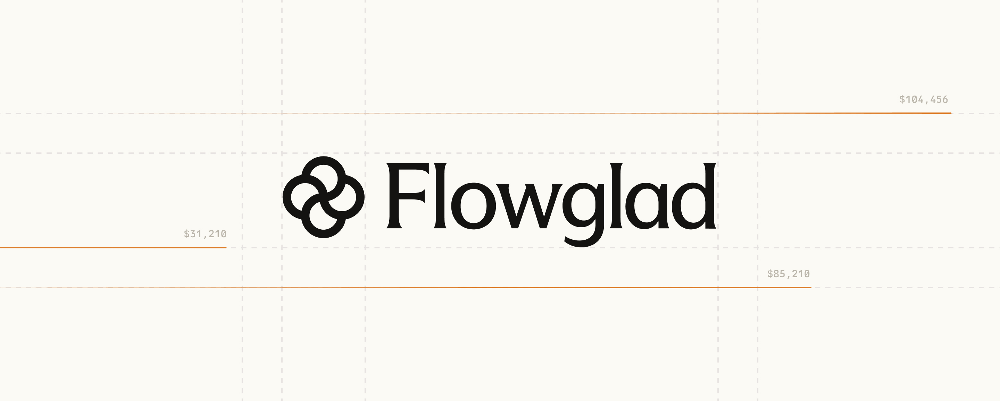

<p align="center">
  <a href="https://github.com/flowglad/flowglad">
    <picture>
      <source media="(prefers-color-scheme: dark)" srcset="./public/github-image-banner-dark-mode.jpg">
      <source media="(prefers-color-scheme: light)" srcset="./public/github-image-banner-light-mode.jpg">
      
    </picture>
  </a>

  <h3 align="center">Flowglad</h3>

  <p align="center">
    The easiest way to make internet money.
    <br />
    <a href="https://flowglad.com"><strong>Get Started</strong></a>
    <br />
    <br />
    ·
    <a href="https://docs.flowglad.com/quickstart">Quickstart</a>
    ·
    <a href="https://flowglad.com">Website</a>
    ·
    <a href="https://luma.com/flowglad">Events</a>
    ·
    <a href="https://github.com/flowglad/flowglad/issues">Issues</a>
    ·
    <a href="https://github.com/flowglad/examples">Examples</a>
    ·
  </p>
</p>

<p align="center">
  <a href="https://app.flowglad.com/invite-discord">
    
  </a>
  <a href="https://twitter.com/intent/follow?screen_name=flowglad">
    
  </a>
  <a href="https://www.ycombinator.com/companies/flowglad">
    
  </a>
</p>

<div align="center">
  <p>
    Infinite pricing models, one source of truth, zero webhooks.
  </p>
</div>


---

## Table of Contents

- [Features](#features)
- [Installation](#installation)
- [Quick Start](#quick-start)
- [Usage Examples](#usage-examples)
  - [Frontend: Feature Gates and Usage Indicators](#frontend-feature-gates-and-usage-indicators)
  - [Backend: Server-side Billing Checks](#backend-server-side-billing-checks)
- [Configuration](#configuration)
- [Pricing Model Templates](#pricing-model-templates)
- [Examples](#examples)
- [Built With](#built-with)
- [Project Goals](#project-goals)

---

## Features

- **Default Stateless** - Say goodbye to webhooks, `"subscriptions"` db tables, `customer_id` columns, `PRICE_ID` env variables, or manually mapping your plans to prices to features and back.
- **Single Source of Truth** - Read your latest customer billing state from Flowglad, including feature access and usage meter credits
- **Access Data Using Your IDs** - Query customer state by your auth's user ids. Refer to prices, features, and usage meters via slugs you define.
- **Full-Stack SDK** - Access your customer's data on the backend using `flowgladServer.getBilling()`, or in your React frontend using our `useBilling()` hook
- **Adaptable** - Iterate on new pricing models in testmode, and push them to prod in a click. Seamlessly rotate pricing models in your app without any redeployment.

---

## Installation

### Prerequisites

- **Node.js** 18.x or higher
- **Bun** (recommended) or npm/yarn/pnpm
- A Flowglad account ([sign up here](https://app.flowglad.com))

### Package Installation

Choose the package(s) that match your stack:

#### Next.js (App Router or Pages Router)

```bash
bun add @flowglad/nextjs
```

or

```bash
npm install @flowglad/nextjs
```

#### React + Express

```bash
bun add @flowglad/react @flowglad/express
```

or

```bash
npm install @flowglad/react @flowglad/express
```

#### React + Node.js (Other Backends)

```bash
bun add @flowglad/react @flowglad/server
```

or

```bash
npm install @flowglad/react @flowglad/server
```

### Environment Variables

Add your Flowglad API keys to your `.env` file:

```bash
FLOWGLAD_SECRET_KEY=your_secret_key_here
NEXT_PUBLIC_FLOWGLAD_PUBLIC_KEY=your_public_key_here
```

Get your keys from the [Flowglad Dashboard](https://app.flowglad.com/settings/api-keys).

---

## Quick Start

Flowglad integrates seamlessly with your existing authentication system. Setup typically takes **under 5 minutes**.

### Step 1: Configure Your Flowglad Server Client

Create a utility file to initialize your Flowglad server instance:

```ts
// lib/flowglad.ts
import { FlowgladServer } from '@flowglad/nextjs/server'

export const flowglad = (customerExternalId: string) => {
  return new FlowgladServer({
    customerExternalId,
    getCustomerDetails: async (externalId) => {
      // Fetch user info from your database using your user/org/team ID
      const user = await db.users.findOne({ id: externalId })
      if (!user) throw new Error('User not found')
      return { 
        email: user.email, 
        name: user.name 
      }
    },
  })
}
```

> **Note:** Use your own customer IDs:
> - **B2C apps:** Use `user.id` as the customer ID
> - **B2B apps:** Use `organization.id` or `team.id` as the customer ID

### Step 2: Expose the Flowglad API Handler

Add an API route for the Flowglad client to communicate with your backend:

```ts
// app/api/flowglad/[...path]/route.ts (Next.js App Router)
import { nextRouteHandler } from '@flowglad/nextjs/server'
import { flowglad } from '@/lib/flowglad'

export const { GET, POST } = nextRouteHandler({
  flowglad,
  getCustomerExternalId: async (req) => {
    // Extract your user/org/team ID from session/auth
    const userId = await getUserIdFromRequest(req)
    if (!userId) throw new Error('User not authenticated')
    return userId
  },
})
```

<details>
<summary><strong>Pages Router Example</strong></summary>

```ts
// pages/api/flowglad/[...path].ts (Next.js Pages Router)
import { nextRouteHandler } from '@flowglad/nextjs/server'
import { flowglad } from '@/lib/flowglad'

export default nextRouteHandler({
  flowglad,
  getCustomerExternalId: async (req) => {
    const userId = await getUserIdFromRequest(req)
    if (!userId) throw new Error('User not authenticated')
    return userId
  },
})
```

</details>

### Step 3: Wrap Your App with the Provider

Add the Flowglad provider to your root layout:

**App Router (app/layout.tsx):**

```tsx
import { FlowgladProvider } from '@flowglad/nextjs'

export default function RootLayout({ children }: { children: React.ReactNode }) {
  return (
    <html lang="en">
      <body>
        <FlowgladProvider loadBilling={true}>
          {children}
        </FlowgladProvider>
      </body>
    </html>
  )
}
```

**Pages Router (_app.tsx):**

```tsx
import { FlowgladProvider } from '@flowglad/nextjs'
import type { AppProps } from 'next/app'

export default function App({ Component, pageProps }: AppProps) {
  return (
    <FlowgladProvider loadBilling={true}>
      <Component {...pageProps} />
    </FlowgladProvider>
  )
}
```

### Step 4: Create Your Pricing Model

Set up your pricing model in the [Flowglad Dashboard](https://app.flowglad.com/pricing-models). Choose from templates or create a custom model.

**That's it!** You're ready to start using Flowglad in your app.

---

## Usage Examples

### Frontend: Feature Gates and Usage Indicators

#### Feature Access Control

Use the `useBilling` hook to check if a customer has access to a specific feature:

```tsx
'use client'

import { useBilling } from '@flowglad/nextjs'

export function FeatureGate({ 
  featureSlug, 
  children 
}: { 
  featureSlug: string
  children: React.ReactNode 
}) {
  const { loaded, errors, checkFeatureAccess } = useBilling()

  if (!loaded || !checkFeatureAccess) {
    return <p>Loading billing state...</p>
  }

  if (errors?.length) {
    return <p>Unable to load billing data right now.</p>
  }

  const hasAccess = checkFeatureAccess(featureSlug)

  return hasAccess 
    ? <>{children}</>
    : <p>You need to upgrade to unlock this feature.</p>
}
```

**Usage:**

```tsx
<FeatureGate featureSlug="advanced_analytics">
  <AdvancedAnalyticsDashboard />
</FeatureGate>
```

#### Usage Balance Indicator

Display usage credits and offer upsells when depleted:

```tsx
'use client'

import { useBilling } from '@flowglad/nextjs'

export function UsageBalanceIndicator({ 
  usageMeterSlug 
}: { 
  usageMeterSlug: string 
}) {
  const { loaded, errors, checkUsageBalance, createCheckoutSession } = useBilling()

  if (!loaded || !checkUsageBalance) {
    return <p>Loading usage...</p>
  }

  if (errors?.length) {
    return <p>Unable to load usage data.</p>
  }

  const usage = checkUsageBalance(usageMeterSlug)

  return (
    <div className="usage-indicator">
      <h3>Usage Balance</h3>
      {usage && usage.availableBalance > 0 ? (
        <p>Remaining: {usage.availableBalance} credits</p>
      ) : (
        <div>
          <p>No credits remaining</p>
          <button 
            onClick={() => createCheckoutSession({ 
              priceSlug: 'pro_plan',
              autoRedirect: true
            })}
          >
            Upgrade to Pro
          </button>
        </div>
      )}
    </div>
  )
}
```

#### Create Checkout Sessions

Redirect users to a Stripe checkout session:

```tsx
'use client'

import { useBilling } from '@flowglad/nextjs'

export function UpgradeButton() {
  const { createCheckoutSession } = useBilling()

  const handleUpgrade = () => {
    createCheckoutSession({
      priceSlug: 'pro_plan',
      autoRedirect: true,
      successUrl: '/dashboard?upgrade=success',
      cancelUrl: '/pricing'
    })
  }

  return (
    <button onClick={handleUpgrade}>
      Upgrade to Pro
    </button>
  )
}
```

### Backend: Server-side Billing Checks

#### Feature Access Check

Gate features on the server side:

```ts
import { NextResponse } from 'next/server'
import { flowglad } from '@/lib/flowglad'
import { getUser } from '@/lib/auth'

export async function POST(req: Request) {
  const user = await getUser()
  
  const billing = await flowglad(user.id).getBilling()
  const hasAccess = billing.checkFeatureAccess('fast_generations')
  
  if (!hasAccess) {
    return NextResponse.json(
      { error: 'Upgrade required for fast generations' },
      { status: 403 }
    )
  }

  // Proceed with fast generation logic
  const result = await runFastGeneration()
  return NextResponse.json(result)
}
```

#### Usage Balance Check

Verify usage credits before processing requests:

```ts
import { flowglad } from '@/lib/flowglad'
import { getUser } from '@/lib/auth'

export async function processChatMessage(params: { message: string }) {
  const user = await getUser()

  const billing = await flowglad(user.id).getBilling()
  const usage = billing.checkUsageBalance('chat_messages')
  
  if (usage.availableBalance <= 0) {
    throw new Error(`User ${user.id} does not have sufficient usage credits`)
  }

  // Process chat message
  const response = await generateChatResponse(params.message)
  
  // Optionally report usage
  await flowglad(user.id).reportUsage('chat_messages', 1)
  
  return response
}
```

#### Multiple Feature Checks

Check multiple features at once:

```ts
import { flowglad } from '@/lib/flowglad'
import { getUser } from '@/lib/auth'

export async function GET() {
  const user = await getUser()
  const billing = await flowglad(user.id).getBilling()

  const features = {
    hasAdvancedAnalytics: billing.checkFeatureAccess('advanced_analytics'),
    hasApiAccess: billing.checkFeatureAccess('api_access'),
    hasPrioritySupport: billing.checkFeatureAccess('priority_support'),
    chatCredits: billing.checkUsageBalance('chat_messages')
  }

  return Response.json(features)
}
```

---

## Configuration

### Flowglad Server Options

The `FlowgladServer` constructor accepts the following options:

```ts
new FlowgladServer({
  customerExternalId: string,           // Your app's customer ID
  getCustomerDetails: async (id) => {   // Fetch customer info from your DB
    email: string,
    name?: string
  },
  apiKey?: string,                      // Optional: Override default API key
  environment?: 'test' | 'live'         // Optional: Default is 'live'
})
```

### Flowglad Provider Options

The `FlowgladProvider` accepts the following props:

```tsx
<FlowgladProvider
  loadBilling={true}              // Auto-load billing state on mount
  apiEndpoint="/api/flowglad"     // Optional: Custom API route
  onError={(error) => {}}         // Optional: Error handler
>
  {children}
</FlowgladProvider>
```

---

## Pricing Model Templates

Create a pricing model in the [Flowglad Dashboard](https://app.flowglad.com/pricing-models) using one of these templates:

| Template | Description | Example Use Case |
|----------|-------------|------------------|
| **Usage-limit + Subscription Hybrid** | Combines recurring subscription with usage caps | Cursor, GitHub Copilot |
| **Unlimited Usage** | Flat-rate subscription with unlimited access | ChatGPT Plus, Netflix |
| **Tiered Access and Usage Credits** | Multiple tiers with usage allowances | Midjourney, OpenAI API |
| **Feature-Gated Subscription** | Plans with different feature access | Linear, Notion |

Don't see what you need? Build a custom pricing model from scratch.

---

## Examples

Explore full working examples in our [examples repository](https://github.com/flowglad/examples):

- **[Generation-Based Subscription](https://github.com/flowglad/examples/tree/main/generation-based-subscription)** - Usage-based billing for AI generation apps
- **[Tiered Usage-Gated Subscription](https://github.com/flowglad/examples/tree/main/tiered-usage-gated-subscription)** - Multiple plans with usage limits
- **[Usage Limit Subscription](https://github.com/flowglad/examples/tree/main/usage-limit-subscription)** - Simple subscription with monthly usage caps

---

## Built With

- [Next.js](https://nextjs.org/?ref=flowglad.com) - React framework
- [tRPC](https://trpc.io/?ref=flowglad.com) - End-to-end typesafe APIs
- [React.js](https://reactjs.org/?ref=flowglad.com) - UI library
- [Tailwind CSS](https://tailwindcss.com/?ref=flowglad.com) - Utility-first CSS
- [Drizzle ORM](https://orm.drizzle.team/?ref=flowglad.com) - TypeScript ORM
- [Zod](https://zod.dev/?ref=flowglad.com) - Schema validation
- [Trigger.dev](https://trigger.dev/?ref=flowglad.com) - Background jobs
- [Supabase](https://supabase.com/?ref=flowglad.com) - Backend platform
- [Better Auth](https://better-auth.com/?ref=flowglad.com) - Authentication

---

## Project Goals

In the last 15 years, the market has given developers more options than ever for every single part of their stack. But when it comes to payments, there have been virtually zero new entrants. The existing options are slim, and almost all of them require us to talk to sales to even set up an account. When it comes to _self-serve_ payments, there are even fewer options.

The result? The developer experience and cost of payments has barely improved in that time. Best in class DX in payments feels eerily suspended in 2015. Meanwhile, we've enjoyed constant improvements in auth, compute, hosting, and practically everything else.

**Flowglad wants to change that.**

We're building a payments layer that lets you:

- Think about billing and payments as little as possible
- Spend as little time on integration and maintenance as possible
- Get as much out of your single integration as possible
- Unlock more payment providers from a single integration

Achieving this mission will take time. It will be hard. It might even make some people unhappy. But with AI bringing more and more developers on line and exploding the complexity of startup billing, the need is more urgent than ever.

---

## Contributing

We welcome contributions! Please see [CONTRIBUTING.md](CONTRIBUTING.md) for details.

## License

This project is licensed under the MIT License - see the [LICENSE](LICENSE) file for details.

## Support

- **Documentation:** [docs.flowglad.com](https://docs.flowglad.com)
- **Discord:** [Join our community](https://app.flowglad.com/invite-discord)
- **Issues:** [GitHub Issues](https://github.com/flowglad/flowglad/issues)
- **Email:** support@flowglad.com
