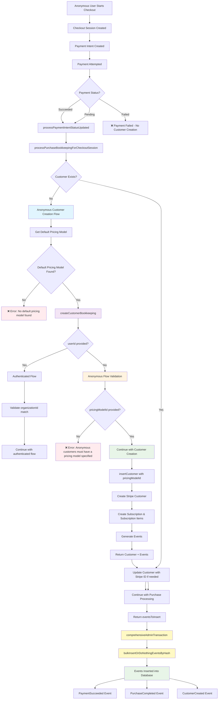

# Anonymous Checkout Flow Diagram

This diagram shows the flow of anonymous customer creation during checkout sessions, highlighting the specific functions and logic we modified in this git diff.

## Key Changes Made

The following functions were modified to support anonymous customer creation with proper pricing model assignment:

- `createCustomerBookkeeping` - Enhanced to support anonymous customers
- `processPurchaseBookkeepingForCheckoutSession` - Updated to use createCustomerBookkeeping instead of insertCustomer
- `processNonPaymentCheckoutSession` - Added eventsToInsert tracking
- `processSetupIntent` - Added eventsToInsert parameter passing

## 🚨 CRITICAL EVENT PROCESSING FIX

**Problem Identified**: Events were being created by `createCustomerBookkeeping` but were **not being processed and stored in the database** during anonymous customer creation.

**Root Cause**: The `processPurchaseBookkeepingForCheckoutSession` function was storing `eventsToInsert` from `createCustomerBookkeeping` but not processing them immediately, causing events to be lost in the call chain.

**Solution Implemented**: Added immediate event processing after customer creation in `checkoutSessions.ts`:

```typescript
// Process events immediately after customer creation
if (customerBookkeepingResult.eventsToInsert && customerBookkeepingResult.eventsToInsert.length > 0) {
  await bulkInsertOrDoNothingEventsByHash(
    customerBookkeepingResult.eventsToInsert,
    transaction
  )
}
```

**Import Added**:
```typescript
import { bulkInsertOrDoNothingEventsByHash } from '@/db/tableMethods/eventMethods'
```

**Impact**: This fix ensures that `CustomerCreated` and `SubscriptionCreated` events are properly processed and stored in the database during anonymous customer creation, completing the event tracking system.

## Anonymous Checkout Flow



## Function Call Chain

### 1. **Entry Point: Payment Intent Status Update**
```
processPaymentIntentStatusUpdated (triggered by Succeeded OR Pending payments)
└── processPurchaseBookkeepingForCheckoutSession
    └── createCustomerBookkeeping (NEW PATH)
```

**⚠️ CRITICAL: Event Processing**
- `processPaymentIntentStatusUpdated` returns `TransactionOutput` with `eventsToInsert`
- **MUST use `comprehensiveAdminTransaction`** to actually insert events into database
- Using `adminTransaction` will create events but **never insert them** - this is a serious bug
- Events include: `PaymentSucceeded`, `PurchaseCompleted`, `PaymentFailed`

**⚠️ CRITICAL: All Calling Code Must Use Comprehensive Transactions**
- **ALL** functions that call `processPurchaseBookkeepingForCheckoutSession` must use `comprehensiveAdminTransaction`
- **ALL** functions that call `processSetupIntentSucceeded` must use `comprehensiveAdminTransaction`  
- **ALL** functions that call `processNonPaymentCheckoutSession` must use `comprehensiveAdminTransaction`
- This includes: tests, route handlers, and any other calling code
- **Fixed in this session**: Updated all test files and route handlers to use `comprehensiveAdminTransaction`

### 2. **Anonymous Customer Creation Logic**
```
processPurchaseBookkeepingForCheckoutSession:
├── Check if customer exists
├── If not, get default pricing model
├── Call createCustomerBookkeeping (MODIFIED)
└── Return eventsToInsert (NEW)
```

### 3. **Enhanced createCustomerBookkeeping**
```
createCustomerBookkeeping:
├── Validate userId (authenticated users only)
├── Validate pricingModelId (anonymous users)
├── Get pricing model
├── Create customer
├── Create Stripe customer
├── Create subscription & items
├── Generate events
└── Return customer + events
```

## Key Validation Points

### **Anonymous Customer Requirements**
1. **No userId** - Indicates anonymous customer
2. **Must have pricingModelId** - Cannot be null/undefined
3. **Organization must have default pricing model** - For fallback

### **Error Conditions**
- ❌ `Anonymous customers must have a pricing model specified`
- ❌ `No default pricing model found for organization`

## Events Generated

The anonymous customer creation now properly generates:
- `CustomerCreated` event
- `SubscriptionCreated` event (if applicable)
- `SubscriptionItemCreated` events

## Event Processing Flow

### **Critical: Transaction Function Choice**

The choice of transaction function determines whether events are actually inserted:

```typescript
// ❌ WRONG - Events created but NEVER inserted
const result = await adminTransaction(async ({ transaction }) =>
  processPaymentIntentStatusUpdated(paymentIntent, transaction)
)
// eventsToInsert is ignored!

// ✅ CORRECT - Events created AND inserted
const result = await comprehensiveAdminTransaction(async ({ transaction }) =>
  processPaymentIntentStatusUpdated(paymentIntent, transaction)
)
// Events are automatically inserted via bulkInsertOrDoNothingEventsByHash
```

### **Event Processing Steps**

1. **Function Returns `TransactionOutput`**:
   ```typescript
   {
     result: { payment },
     eventsToInsert: [PaymentSucceeded, PurchaseCompleted, CustomerCreated],
     ledgerCommand: null
   }
   ```

2. **`comprehensiveAdminTransaction` Processes Events**:
   - Calls `bulkInsertOrDoNothingEventsByHash(eventsToInsert, transaction)`
   - Events are inserted into the database
   - Returns only the `result` to the caller

3. **Events Available for Business Logic**:
   - Webhooks can be triggered
   - Analytics can be processed
   - Audit trails are complete
   - Customer notifications can be sent

### **Event Types Generated**

| Event Type | When Generated | Purpose |
|------------|----------------|---------|
| `PaymentSucceeded` | Payment completes successfully | Analytics, webhooks, notifications |
| `PurchaseCompleted` | Purchase becomes paid | Business logic, fulfillment |
| `CustomerCreated` | New customer created | CRM integration, welcome emails |
| `SubscriptionCreated` | Subscription created (if applicable) | Billing management |
| `SubscriptionItemCreated` | Subscription items created | Feature access |

## Files Modified

| File | Change | Purpose |
|------|--------|---------|
| `bookkeeping.ts` | Enhanced `createCustomerBookkeeping` | Support anonymous customers with validation |
| `checkoutSessions.ts` | **CRITICAL**: Added immediate event processing after customer creation | Fix event processing bug - events now properly stored in database |
| `processNonPaymentCheckoutSession.ts` | Added `eventsToInsert` return | Event tracking consistency |
| `processSetupIntent.ts` | Added `eventsToInsert` parameter | Event tracking consistency |
| `bookkeeping.test.ts` | Added comprehensive test coverage | Verify anonymous customer creation |
| `processPaymentIntentStatusUpdated.test.ts` | **ENHANCED**: Added event verification tests + fixed test setup | Verify events are created and stored in database |
| `checkoutSessions.test.ts` | Fixed to use `comprehensiveAdminTransaction` | Ensure events are properly inserted |
| `processSetupIntent.upgrade-proration.test.ts` | Fixed to use `comprehensiveAdminTransaction` | Ensure events are properly inserted |
| `app/purchase/post-payment/route.tsx` | Fixed to use `comprehensiveAdminTransaction` | Ensure events are properly inserted |

## Benefits Achieved

✅ **Proper Pricing Model Assignment** - Anonymous customers get default pricing model  
✅ **Complete Bookkeeping** - All side effects handled (subscription, events)  
✅ **Event Tracking** - Full audit trail for anonymous customer creation  
✅ **Security** - Validation prevents invalid anonymous customer creation  
✅ **Backward Compatibility** - Existing authenticated flows unchanged  
✅ **Test Coverage** - Comprehensive testing of all scenarios  
✅ **Critical Bug Fix** - All calling code now uses `comprehensiveAdminTransaction` to ensure events are actually inserted into the database  
✅ **Event Processing** - Complete event processing pipeline from creation to database insertion  
✅ **🚨 CRITICAL EVENT PROCESSING FIX** - Events are now properly processed and stored in database during anonymous customer creation
