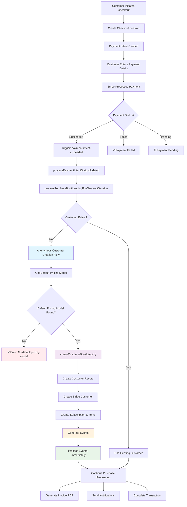
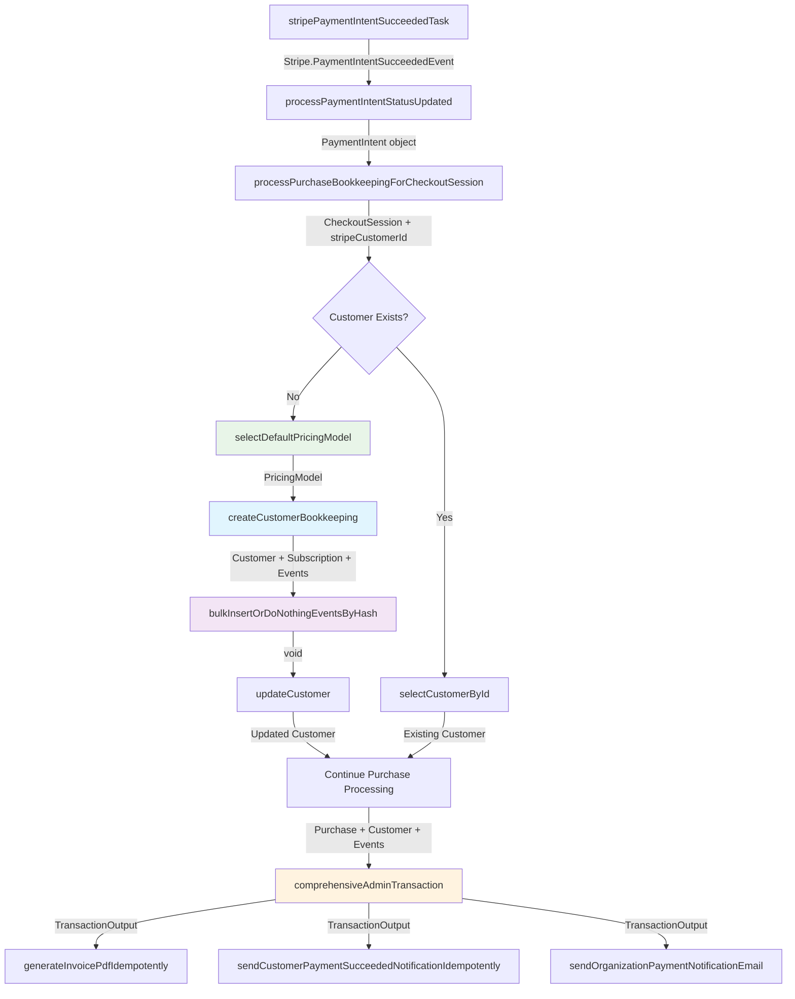
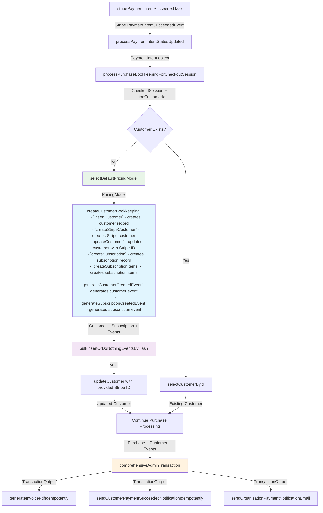
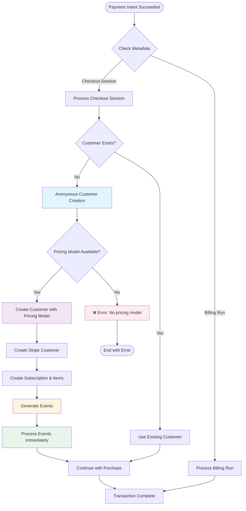
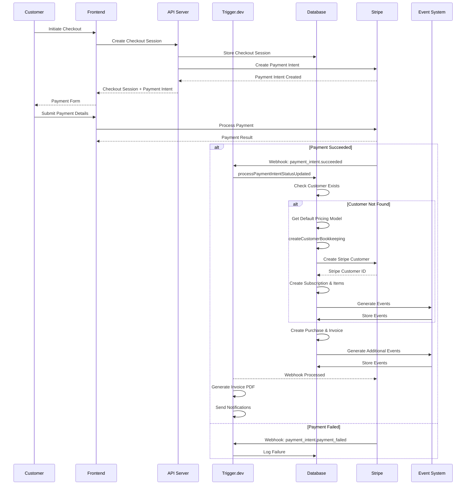
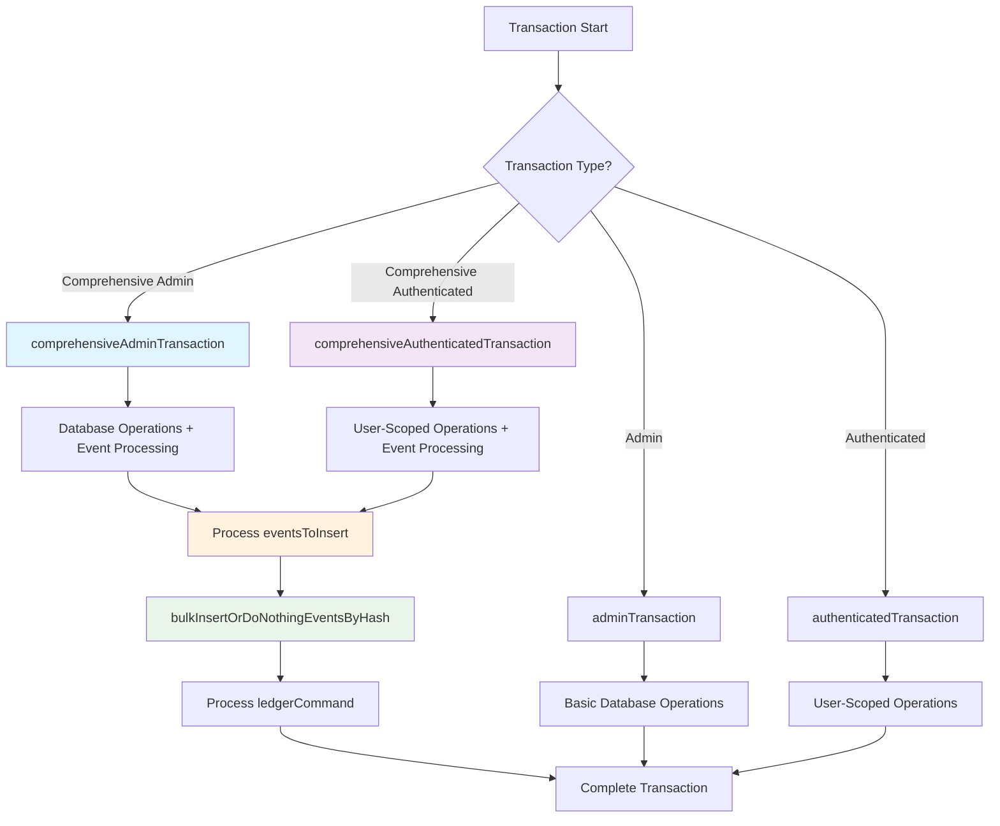

# Anonymous Customer Creation System Architecture

This document provides a comprehensive overview of the anonymous customer creation system, including the complex event processing pipeline, transaction management, and the various components that work together to enable frictionless checkout experiences.

## Table of Contents
1. [System Overview](#system-overview)
2. [Architecture Diagrams](#architecture-diagrams)
3. [Event Processing Pipeline](#event-processing-pipeline)
4. [Transaction Management](#transaction-management)
5. [Code Implementation](#code-implementation)
6. [Key Components](#key-components)

## System Overview

The anonymous customer creation system enables customers to make purchases without requiring authentication, while maintaining proper audit trails, pricing model assignments, and event tracking. The system uses a sophisticated "lazy account creation" pattern where customers can later create accounts and link their purchases.

### Core Principles
- **Frictionless Checkout**: No signup required for purchases
- **Smart Account Linking**: Multiple purchases automatically linked by email
- **Security-First**: Only creates accounts when explicitly requested
- **User-Controlled**: Customer decides when to create account
- **Complete Audit Trail**: All actions tracked through events

## Architecture Diagrams

### 1. System Flow Diagram (Mermaid)



### 2. Function-Level Data Flow Diagram (Mermaid)



### 3. Detailed Function-Level Data Flow (Mermaid)



**Internal operations within `createCustomerBookkeeping`:**
- `insertCustomer` - creates customer record
- `createStripeCustomer` - creates Stripe customer
- `updateCustomer` - updates customer with Stripe ID
- `createSubscription` - creates subscription record
- `createSubscriptionItems` - creates subscription items
- `generateCustomerCreatedEvent` - generates customer event
- `generateSubscriptionCreatedEvent` - generates subscription event

### 4. Conditional Flow Diagram (Mermaid)



### 3. Network/Request-Response Diagram (Mermaid)



## Event Processing Pipeline

### Event Types Generated

1. **CustomerCreated**: When a new customer is created
2. **SubscriptionCreated**: When a subscription is created for the customer
3. **PaymentSucceeded**: When payment is successfully processed
4. **PurchaseCompleted**: When the purchase is finalized

### Event Processing Flow

```mermaid
flowchart LR
    A[createCustomerBookkeeping] --> B[Generate Events]
    B --> C[Return eventsToInsert]
    C --> D[processPurchaseBookkeepingForCheckoutSession]
    D --> E[bulkInsertOrDoNothingEventsByHash]
    E --> F[Events Stored in Database]
    F --> G[comprehensiveAdminTransaction]
    G --> H[Process Additional Events]
    H --> I[Complete Transaction]
    
    style A fill:#e1f5fe
    style B fill:#f3e5f5
    style E fill:#fff3e0
    style F fill:#e8f5e8
```



## Transaction Management

### Transaction Types

1. **adminTransaction**: Basic admin operations
2. **comprehensiveAdminTransaction**: Admin operations with event processing
3. **authenticatedTransaction**: User-scoped operations
4. **comprehensiveAuthenticatedTransaction**: User-scoped operations with event processing

### Transaction Flow



## Code Implementation

### Core Functions

#### 1. createCustomerBookkeeping

```typescript
export const createCustomerBookkeeping = async (
  payload: {
    customer: Omit<Customer.Insert, 'livemode'>
  },
  {
    transaction,
    organizationId,
    livemode,
    userId, // Optional for anonymous customers
  }: Omit<AuthenticatedTransactionParams, 'userId'> & { userId?: string }
): Promise<TransactionOutput<{
  customer: Customer.Record
  subscription?: Subscription.Record
  subscriptionItems?: SubscriptionItem.Record[]
}>>
```

**Key Features:**
- Supports both authenticated and anonymous customers
- Validates organizationId for authenticated users only
- Requires pricing model for anonymous customers
- Creates Stripe customer automatically
- Generates subscription and subscription items
- Returns events for audit trail

#### 2. processPurchaseBookkeepingForCheckoutSession

```typescript
export const processPurchaseBookkeepingForCheckoutSession = async (
  {
    checkoutSession,
    stripeCustomerId: providedStripeCustomerId,
  }: {
    checkoutSession: CheckoutSession.Record
    stripeCustomerId: string | null
  },
  transaction: DbTransaction
): Promise<{
  purchase: Purchase.Record
  customer: Customer.Record
  discount?: Discount.Record
  feeCalculation: FeeCalculation.Record
  discountRedemption?: DiscountRedemption.Record
  eventsToInsert: Event.Insert[]
}>
```

**Key Features:**
- Handles both existing and new customers
- Uses createCustomerBookkeeping for anonymous customers
- Processes events immediately after customer creation
- Returns events for further processing

#### 3. comprehensiveAdminTransaction

```typescript
export async function comprehensiveAdminTransaction<T>(
  fn: (
    params: AdminTransactionParams
  ) => Promise<TransactionOutput<T>>,
  options: AdminTransactionOptions = {}
): Promise<T>
```

**Key Features:**
- Processes eventsToInsert automatically
- Handles ledger commands
- Returns only the result part (not the full TransactionOutput)
- Ensures proper event storage

### Event Processing Implementation

```typescript
// In checkoutSessions.ts - Immediate event processing
if (customerBookkeepingResult.eventsToInsert && customerBookkeepingResult.eventsToInsert.length > 0) {
  await bulkInsertOrDoNothingEventsByHash(
    customerBookkeepingResult.eventsToInsert,
    transaction
  )
}
```

### Transaction Output Structure

```typescript
export interface TransactionOutput<T> {
  result: T
  eventsToInsert?: Event.Insert[]
  ledgerCommand?: LedgerCommand
}
```

## Key Components

### 1. Database Schema

#### Events Table
```sql
CREATE TABLE events (
  id TEXT PRIMARY KEY,
  type FlowgladEventType NOT NULL,
  payload JSONB NOT NULL,
  occurred_at TIMESTAMPTZ NOT NULL,
  submitted_at TIMESTAMPTZ NOT NULL,
  processed_at TIMESTAMPTZ,
  metadata JSONB NOT NULL,
  object_entity EventNoun,
  object_id INTEGER,
  hash TEXT UNIQUE NOT NULL,
  organization_id TEXT NOT NULL REFERENCES organizations(id)
);
```

#### Customers Table
```sql
CREATE TABLE customers (
  id TEXT PRIMARY KEY,
  email TEXT NOT NULL,
  name TEXT NOT NULL,
  organization_id TEXT NOT NULL REFERENCES organizations(id),
  user_id TEXT REFERENCES users(id), -- NULL for anonymous customers
  pricing_model_id TEXT NOT NULL REFERENCES pricing_models(id),
  stripe_customer_id TEXT,
  external_id TEXT NOT NULL,
  billing_address JSONB,
  livemode BOOLEAN NOT NULL,
  created_at TIMESTAMPTZ NOT NULL,
  updated_at TIMESTAMPTZ NOT NULL
);
```

### 2. Event Types

```typescript
export enum FlowgladEventType {
  CustomerCreated = 'CustomerCreated',
  SubscriptionCreated = 'SubscriptionCreated',
  PaymentSucceeded = 'PaymentSucceeded',
  PurchaseCompleted = 'PurchaseCompleted',
  // ... other event types
}
```

### 3. Transaction Parameters

```typescript
interface AdminTransactionParams {
  transaction: DbTransaction
  userId: string
  livemode: boolean
}

interface AuthenticatedTransactionParams {
  transaction: DbTransaction
  userId: string
  livemode: boolean
  organizationId: string
}
```

## Plain Text Explanation

### How the System Works

1. **Customer Checkout**: A customer visits a checkout page and enters their payment information without creating an account.

2. **Checkout Session Creation**: The system creates a checkout session with the customer's email and payment details, but no `userId` (indicating an anonymous customer).

3. **Payment Processing**: Stripe processes the payment and sends a webhook to the system when the payment succeeds.

4. **Customer Creation**: The system checks if a customer with that email already exists. If not, it creates a new anonymous customer with:
   - `userId: null` (indicating anonymous)
   - Default pricing model from the organization
   - Stripe customer ID for future payments
   - Subscription and subscription items if applicable

5. **Event Generation**: The system generates events for audit purposes:
   - `CustomerCreated` event
   - `SubscriptionCreated` event (if applicable)
   - `PaymentSucceeded` event
   - `PurchaseCompleted` event

6. **Event Processing**: Events are immediately processed and stored in the database using `bulkInsertOrDoNothingEventsByHash`.

7. **Transaction Completion**: The purchase is finalized, invoice is generated, and notifications are sent.

### Key Benefits

- **Frictionless Experience**: Customers can purchase without creating accounts
- **Complete Audit Trail**: All actions are tracked through events
- **Future Account Linking**: Customers can later create accounts and link their purchases
- **Proper Pricing**: Anonymous customers get the organization's default pricing model
- **Stripe Integration**: Automatic Stripe customer creation for future payments

### Security Considerations

- Anonymous customers have `userId: null` (not a fake user ID)
- RLS policies work correctly with null userId
- Organization validation only applies to authenticated users
- Pricing models are required for anonymous customers to prevent free access

### Error Handling

- If no default pricing model exists, customer creation fails
- If Stripe customer creation fails, the transaction is rolled back
- If event processing fails, the transaction is rolled back
- All errors are properly logged and tracked

This system provides a robust, secure, and user-friendly anonymous checkout experience while maintaining complete audit trails and proper business logic.
