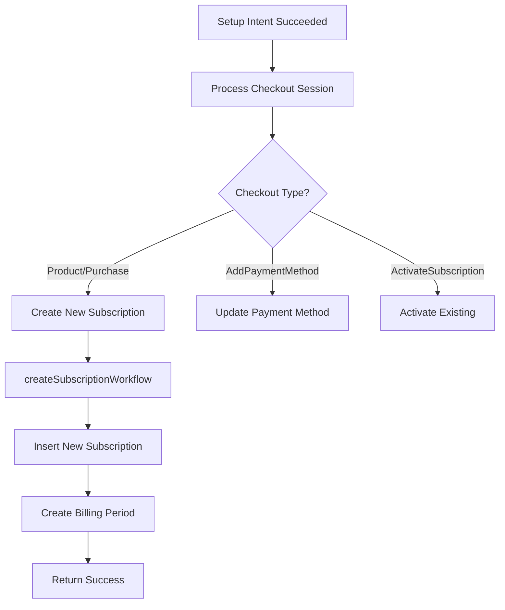
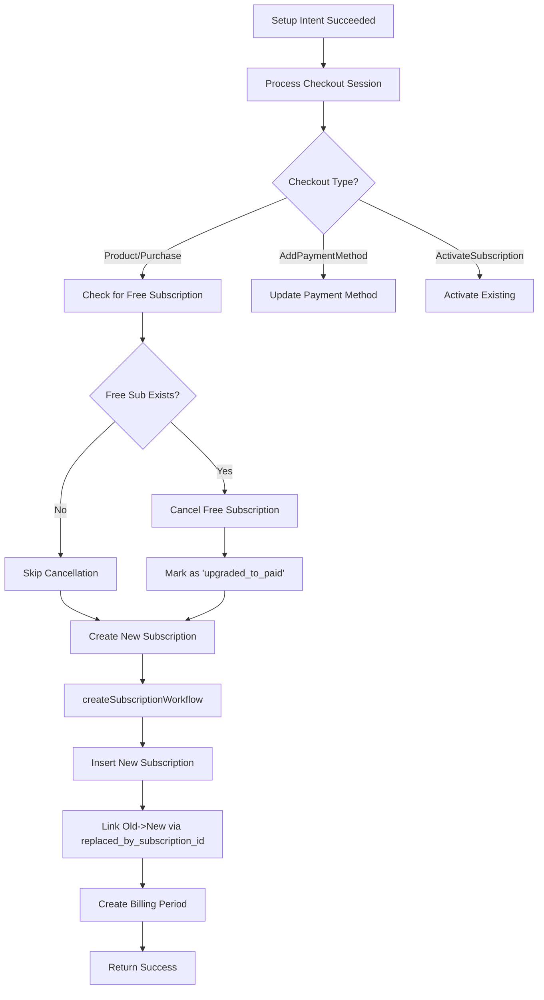

# Subscription Upgrade Logic Schematic

## Current Flow (BEFORE)


## New Flow (AFTER)


## Core Logic Changes

### 1. Entry Point Modification
**File**: `/src/utils/bookkeeping/processSetupIntent.ts`
**Function**: `processSetupIntentSucceeded`

```typescript
// BEFORE: Directly creates subscription
const result = await createSubscriptionFromSetupIntentableCheckoutSession(
  successProcessedResult,
  transaction
)

// AFTER: Check and cancel free subscription first
const canceledFreeSub = await cancelFreeSubscriptionIfExists(customer.id, transaction)
const result = await createSubscriptionFromSetupIntentableCheckoutSession(
  {
    ...successProcessedResult,
    previousSubscriptionId: canceledFreeSub?.id
  },
  transaction
)
if (canceledFreeSub && result.subscription) {
  await linkSubscriptions(canceledFreeSub.id, result.subscription.id, transaction)
}
```

### 2. New Helper Function
**File**: `/src/subscriptions/cancelFreeSubscriptionForUpgrade.ts` (NEW)

```typescript
export async function cancelFreeSubscriptionIfExists(
  customerId: string,
  transaction: DbTransaction
): Promise<Subscription.Record | null> {
  // Find active free subscription
  const subs = await selectSubscriptions({
    customerId,
    status: SubscriptionStatus.Active,
    isFreePlan: true
  }, transaction)
  
  if (subs.length === 0) return null
  
  // Cancel with special reason
  return await updateSubscription({
    id: subs[0].id,
    status: SubscriptionStatus.Canceled,
    canceledAt: new Date(),
    cancellationReason: 'upgraded_to_paid'
  }, transaction)
}
```

### 3. Modified Creation Workflow
**File**: `/src/subscriptions/createSubscription/workflow.ts`
**Function**: `createSubscriptionWorkflow`

```typescript
// AFTER: Accept and handle previous subscription
interface CreateSubscriptionParams {
  // ... existing params ...
  previousSubscriptionId?: string  // NEW
}

// In workflow:
if (params.previousSubscriptionId) {
  // Transfer relevant data from old subscription
  // Add to metadata for tracking
  metadata.upgraded_from = params.previousSubscriptionId
  metadata.upgrade_date = new Date().toISOString()
}
```

### 4. Subscription Linking
**File**: `/src/utils/bookkeeping/processSetupIntent.ts`

```typescript
async function linkSubscriptions(
  oldSubId: string,
  newSubId: string,
  transaction: DbTransaction
): Promise<void> {
  await updateSubscription({
    id: oldSubId,
    replacedBySubscriptionId: newSubId
  }, transaction)
}
```

## Key Decision Points

### Check 1: Is there a free subscription?
```typescript
const freeSubscription = await db
  .select()
  .from(subscriptions)
  .where(and(
    eq(subscriptions.customerId, customerId),
    eq(subscriptions.status, 'active'),
    eq(subscriptions.isFreePlan, true)
  ))
  .limit(1)
```

### Check 2: Is this an upgrade-eligible checkout?
```typescript
const isUpgradeEligible = 
  checkoutSession.type === CheckoutSessionType.Product ||
  checkoutSession.type === CheckoutSessionType.Purchase
```

### Check 3: Should we prevent the upgrade?
```typescript
// Prevent if customer already has paid subscription
const existingPaidSub = await db
  .select()
  .from(subscriptions)
  .where(and(
    eq(subscriptions.customerId, customerId),
    eq(subscriptions.status, 'active'),
    eq(subscriptions.isFreePlan, false)
  ))

if (existingPaidSub.length > 0) {
  throw new Error('Customer already has active paid subscription')
}
```

## Transaction Flow

```typescript
// All operations in single transaction
await comprehensiveAdminTransaction(async ({ transaction }) => {
  // 1. Cancel free subscription
  const canceled = await cancelFreeSubscription(customerId, transaction)
  
  try {
    // 2. Create new subscription
    const newSub = await createSubscription(params, transaction)
    
    // 3. Link them together
    if (canceled) {
      await linkSubscriptions(canceled.id, newSub.id, transaction)
    }
    
    return newSub
  } catch (error) {
    // Transaction automatically rolls back
    // Free subscription remains active
    throw error
  }
})
```

## State Transitions

### Free Subscription States
```
ACTIVE (free) 
  ↓ [setup intent succeeds]
CANCELED (reason: upgraded_to_paid)
```

### New Subscription States
```
NON-EXISTENT
  ↓ [setup intent succeeds]
ACTIVE (paid) with metadata.upgraded_from
```

### Database Record Linkage
```
subscriptions table:
┌─────────────────────────────────────┐
│ Free Subscription                   │
├─────────────────────────────────────┤
│ id: uuid-1                          │
│ status: canceled                    │
│ cancellation_reason: upgraded_to_paid│
│ replaced_by_subscription_id: uuid-2 │◄──┐
└─────────────────────────────────────┘   │
                                           │
┌─────────────────────────────────────┐   │
│ Paid Subscription                   │   │
├─────────────────────────────────────┤   │
│ id: uuid-2                          │───┘
│ status: active                      │
│ metadata.upgraded_from_subscription_id: uuid-1      │
└─────────────────────────────────────┘
```

## Error Handling

### Scenario 1: No Free Subscription
- **Action**: Continue with normal creation
- **Result**: New subscription created, no cancellation

### Scenario 2: Multiple Free Subscriptions (edge case)
- **Action**: Cancel the most recent one
- **Result**: Log warning, proceed with upgrade

### Scenario 3: Creation Fails After Cancellation
- **Action**: Transaction rollback
- **Result**: Free subscription remains active

### Scenario 4: Concurrent Upgrade Attempts
- **Action**: Second attempt sees no free subscription
- **Result**: Fails with "already has paid subscription" error

## Validation Points

1. **Pre-Cancellation**: Verify free subscription exists and is active
2. **Pre-Creation**: Verify no existing paid subscriptions
3. **Post-Creation**: Verify linking successful
4. **Post-Transaction**: Verify exactly one active subscription

## Affected Systems

### Direct Changes Required:
- `processSetupIntentSucceeded` - Add cancellation logic
- `createSubscriptionWorkflow` - Accept previous subscription ID
- Database schema - Add new columns

### Indirect Changes (Queries to Update):
- `selectActiveSubscriptionsForCustomer` - Exclude upgraded-away
- Billing run selection - Skip canceled free subscriptions
- Analytics/metrics - Filter out upgrade cancellations
- Customer portal - Show only current subscription

### No Changes Needed:
- Stripe webhook processing
- Invoice generation
- Payment processing
- Email notifications (unless we want upgrade-specific emails)