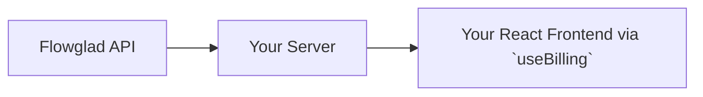
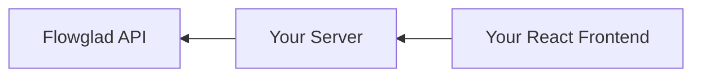
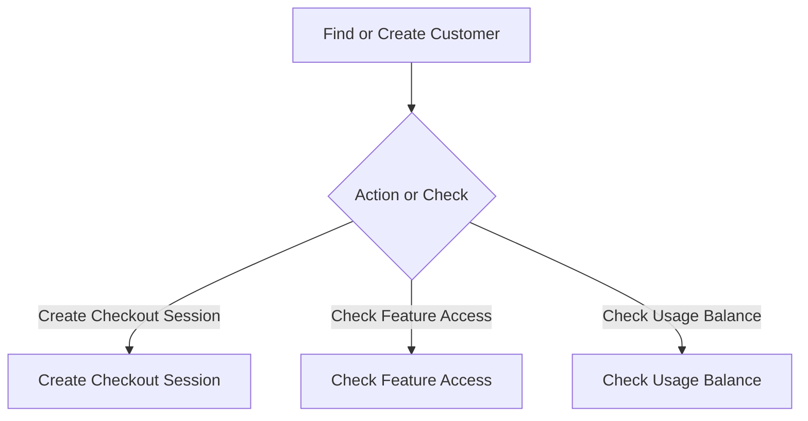
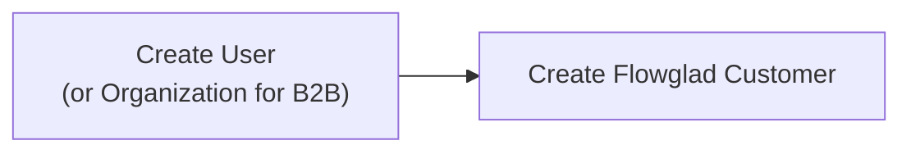

Flowglad offers rich full stack SDKs for Typescript. If your backend is written in another language besides Typescript, you can integrate Flowglad via our public APIs. All you need is a way to make HTTP requests. Even without the SDKs, Flowglad provides a simple integration path.

## Core Concepts
### The Data Flow

In a standard Flowglad integration, data flows from Flowglad's API, to your server, and then from your server to your React frontend. The result is that you no longer need to maintain glue code that syncs the data in your application with the data in Flowglad's servers. 

Instead of this webhook approach, Flowglad is designed to be [reactive](https://en.wikipedia.org/wiki/Reactive_programming).

#### The Read Flow

#### The Write Flow

Similarly, mutations flow in reverse: propogating from your frontend, to your server, to our server. This allows us to deliver the data door-to-door to your frontend code, while ensuring that all the data is scoped to the specific customer.

### The Lifecycle
Every Flowglad workflow in your app should start with an attempt to find or create the customer, and then either take an action or check the state.

### Authentication Coupling

On your backend, Flowglad couples closely with your authentication. Workflows that involve Flowglad should first consider who the customer is that you are making requests for. All customers in your database should have corresponding customer records in Flowglad, regardless of whether they are paying.

To achieve this, start by adding a call to [/create-customer](https://docs.flowglad.com/api-reference/customer/create-customer) in your app's account creation flow.

Flowglad manages the billing state for all your customers, including customers on your free plans. That management includes managing which features your customers can access and what balances they have on your product's usage meters.

#### Account Creation Flow

When you refer to your customers with Flowglad, you do so using *your* customer id, rather than ours. If your customers are individuals, use their `user.id` from your database. If your customers are businesses, teams, or other organizations, you can use their `organization.id`.

<Note>
Integrating Flowglad does not require you to make any schema changes to your database. You do not need to store a `flowglad_customer_id` or `flowglad_price_id`.
</Note>

### Implementation Plan

Implementing Flowglad on your backend will consist of 3 steps:

1. Create a server route at `/api/flowglad/:subroute` that is publicly accessible, and authenticated using your existing server-side authentication logic. Your frontend will send requests to this route via the [@flowglad/react](https://www.npmjs.com/package/@flowglad/react) SDK.

2. Add a Flowglad customer creation

#### Find or Create Customer Profile

