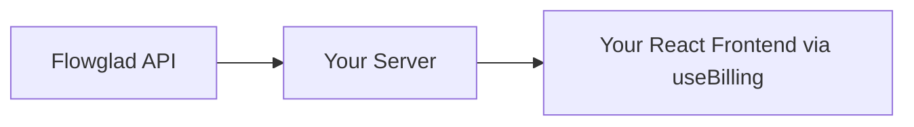
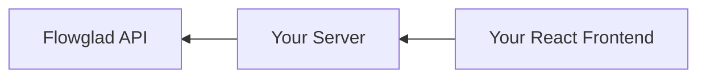
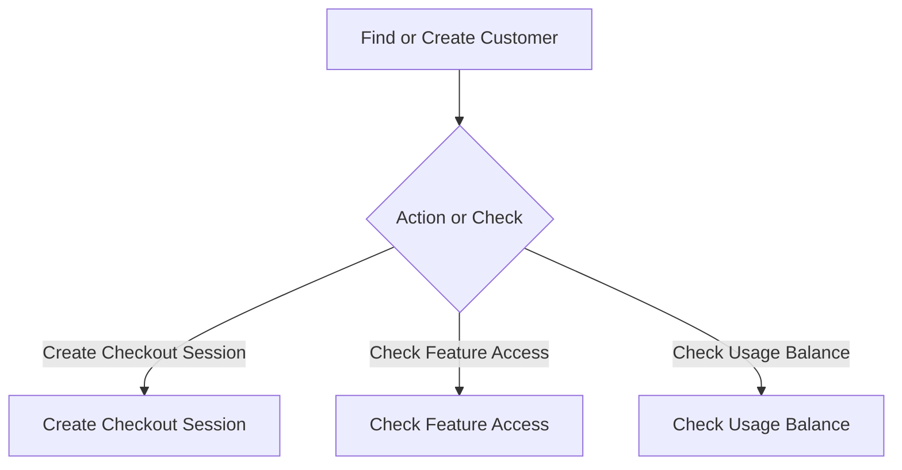
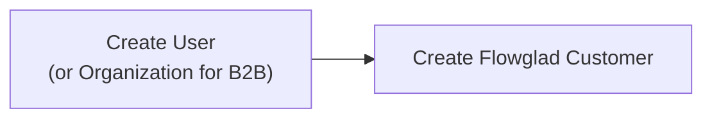

Flowglad offers rich full stack SDKs for Typescript. If your backend is written in another language besides Typescript, you can integrate Flowglad via our public APIs. All you need is a way to make HTTP requests. Even without the SDKs, Flowglad provides a simple integration path.

## Core Concepts
### The Data Flow

In a standard Flowglad integration, data flows from Flowglad's API, to your server, and then from your server to your React frontend. The result is that you no longer need to maintain glue code that syncs the data in your application with the data in Flowglad's servers. 

Instead of this webhook approach, Flowglad is designed to be [reactive](https://en.wikipedia.org/wiki/Reactive_programming).

#### The Read Flow

#### The Write Flow

+Similarly, mutations flow in reverse: propagating from your frontend, to your server, to our server. This allows us to deliver the data door-to-door to your frontend code, while ensuring that all the data is scoped to the specific customer.

### The Lifecycle
Every Flowglad workflow in your app should start with an attempt to find or create the customer, and then either take an action or check the state.

### Authentication Coupling

On your backend, Flowglad couples closely with your authentication. Workflows that involve Flowglad should first consider who the customer is that you are making requests for. All customers in your database should have corresponding customer records in Flowglad, regardless of whether they are paying.

To achieve this, start by adding a call to [/create-customer](https://docs.flowglad.com/api-reference/customer/create-customer) in your app's account creation flow.

Flowglad manages the billing state for all your customers, including customers on your free plans. That management includes managing which features your customers can access and what balances they have on your product's usage meters.

#### Account Creation Flow

When you refer to your customers with Flowglad, you do so using *your* customer id, rather than ours. If your customers are individuals, use their `user.id` from your database. If your customers are businesses, teams, or other organizations, you can use their `organization.id`.

<Note>
Integrating Flowglad does not require you to make any schema changes to your database. You do not need to store a `flowglad_customer_id` or `flowglad_price_id`.
</Note>

### Implementation Plan

Implementing Flowglad on your backend will consist of 3 steps (feel free to feed this to AI):

1. Add Flowglad customer creation to your product's account creation flow
  - Call [POST /customers](https://docs.flowglad.com/api-reference/customer/create-customer) to create the customer

2. Create a server route at `/api/flowglad/:subroute` that is publicly accessible and authenticated using your existing server-side authentication logic. Your frontend will send requests to this route via the [@flowglad/react](https://www.npmjs.com/package/@flowglad/react) SDK.

3. Implement a set of helper functions in your backend to handle common actions:
   - `findOrCreateCustomerBilling({ name: string, externalId: string, email: string })`:
     call [GET /customers/:externalId/billing](https://docs.flowglad.com/api-reference/customer/get-customer). If you receive a 404, call [POST /customers](https://docs.flowglad.com/api-reference/customer/create-customer) to create the customer
   - `checkFeatureAccess(slug: string, customerBilling: <GET /customers/:externalId response>)`:
        - gets `experimental.featureItems` payload in the first `currentSubscription` in the customer billing response
        - returns true if a feature is present where `feature.type=="toggle" && feature.slug == slug`
        - returns false otherwise
   - if you plan to track usage in real time: `checkUsageBalance(slug: string, customerBilling: <GET /customers/:externalId response>)`:
        - gets `experimental.usageMeterBalances` in the first `currentSubscription` in the customer billing response
        - finds the `usageMeterBalance` where `usageMeterBalance.slug == slug`
        - returns `{ availableBalance: number }` if the usageMeterBalance is found, using `usageMeterBalance.availableBalance`
        - returns `null` if not found

### Authenticate and Derive the Requesting Customer

Every server-originated Flowglad call needs the customer scoped using your ids. The `FlowgladServer` class uses a scoped pattern:

- Create a factory function that takes `customerExternalId` (from **your app's database**, not Flowglad's) and returns a `FlowgladServer` instance
- Provide a `getCustomerDetails` function that fetches customer name and email from your database
- Use the scoped instance: `await flowglad(customerExternalId).getBilling()`

**Important:** `customerExternalId` is the ID from **your app's database** (e.g., `user.id` or `organization.id`), **not** Flowglad's customer ID.

**B2C apps:** Use `user.id` as `customerExternalId`  
**B2B apps:** Use `organization.id` or `team.id` as `customerExternalId`

When you are not using our SDKs, replicate the same logic:

1. Extract the `customerExternalId` from your authentication (user ID for B2C, organization ID for B2B) - this is **your app's ID**, not Flowglad's
2. Fetch customer details (name, email) from your database
3. Pass `customerExternalId` (your app's ID) and customer details to every Flowglad API call

Once you have the customer, you can reuse the helper functions above to translate frontend requests into Flowglad API calls.

#### Implement the Sub-routes
Expose a single authenticated route such as `/api/flowglad/:subroute`. Each subroute matches a `FlowgladActionKey` (see [`packages/shared/src/types.ts`](https://github.com/flowglad/flowglad/blob/main/packages/shared/src/types.ts)) and **must** accept a `POST`, even for reads—the React SDK always sends `POST` requests and expects `{ data, error? }` in the response body.

**POST /customers/billing**
- use your authentication logic to derive the customer making the request from your frontend `{ name: string, externalId: string, email: string }`, where the `email` is the email address associated with the owner of the account and `externalId` is the id of the customer in your system
- use the `findOrCreateCustomerBilling` helper to get the customer billing data, return it inside `{ data: billing }`, and optionally include the computed helpers (`checkFeatureAccess`, `checkUsageBalance`, `getProduct`, `getPrice`) before sending the JSON back to the client.

**POST /checkout-sessions/create**
- accept `{ successUrl, cancelUrl, outputMetadata?, outputName?, quantity?, priceId? | priceSlug? }`.
- if the frontend sent a `priceSlug`, look it up from the catalog you received in `/customers/billing` and substitute the resolved `priceId` before calling [POST /checkout-sessions](https://docs.flowglad.com/api-reference/checkout-sessions/create-checkout-session).
- always include `customerExternalId` (your id) in the request body so Flowglad scopes the checkout correctly.

**POST /checkout-sessions/create-add-payment-method**
- payload mirrors the create endpoint but without price fields, plus an optional `targetSubscriptionId`.
- send `type: "add_payment_method"` to [POST /checkout-sessions](https://docs.flowglad.com/api-reference/checkout-sessions/create-checkout-session).
- respond with the `{ checkoutSession: { id, url } }` object from Flowglad. The React SDK will optionally redirect using the `url`.

**POST /checkout-sessions/create-activate-subscription**
- requires `{ targetSubscriptionId, priceId, successUrl, cancelUrl }`.
- send `type: "activate_subscription"` to [POST /checkout-sessions](https://docs.flowglad.com/api-reference/checkout-sessions/create-checkout-session) so the Flowglad dashboard knows to attach the subscription after payment.

**POST /subscriptions/cancel**
- expect `{ id, cancellation }` where `cancellation` is one of:
  - `{ timing: "at_end_of_current_billing_period" }`
  - `{ timing: "immediately" }`
- fetch the subscription first and confirm that `subscription.customerId` matches the requesting customer's Flowglad id before calling [POST /subscriptions/:id/cancel](https://docs.flowglad.com/api-reference/subscriptions/cancel-subscription). If they do not match, return `403`.
