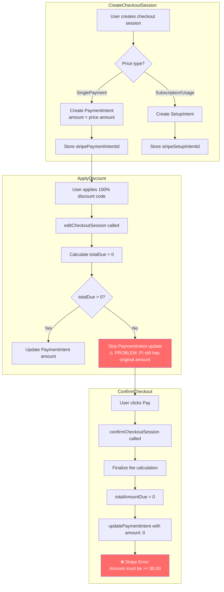

# Current State: 100% Discount Checkout Flow

## Problem

When a 100% discount is applied, the checkout still has a PaymentIntent with the original amount. The `editCheckoutSession` logic skips updating the PaymentIntent when `totalDue === 0`, leaving a stale amount that causes Stripe to fail.

## Flow Diagram

## Key Code Locations

| File | Lines | Description |
|------|-------|-------------|
| `createCheckoutSession.ts` | 306-330 | PaymentIntent created for SinglePayment prices |
| `checkoutSessions.ts` | 155-170 | `if (totalDue > 0)` check skips PI update |
| `confirmCheckoutSession.ts` | 195-218 | Attempts to update PI with final amount (fails if 0) |

## Root Cause

1. PaymentIntent is created at checkout session creation time with the full price amount
2. Discount is applied later via `editCheckoutSession`
3. When discount makes `totalDue = 0`, the code intentionally skips updating the PaymentIntent
4. At confirmation time, attempting to charge $0 via PaymentIntent fails Stripe's minimum amount validation
