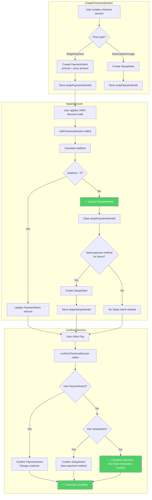

# Option 1: Cancel PaymentIntent and Complete Without Charge

## Overview

When a 100% discount results in `totalDue === 0`, cancel the existing PaymentIntent and complete the checkout as a "free" purchase. Optionally create a SetupIntent if the payment method needs to be saved for future use.

## Flow Diagram



## Implementation Changes

### 1. editCheckoutSession (checkoutSessions.ts)

```typescript
// Around line 155-170
if (stripePaymentIntentId && feeCalculation) {
  const totalDue = await calculateTotalDueAmount(feeCalculation)
  if (totalDue > 0) {
    // Existing logic: update PaymentIntent
    const totalFeeAmount = calculateTotalFeeAmount(feeCalculation)
    await updatePaymentIntent(...)
  } else {
    // NEW: Cancel PaymentIntent when totalDue is 0
    await cancelPaymentIntent(stripePaymentIntentId, feeCalculation.livemode)

    // Clear the PaymentIntent ID from checkout session
    await updateCheckoutSession({
      ...updatedCheckoutSession,
      stripePaymentIntentId: null,
    }, transaction)

    // Optionally create SetupIntent if payment method needed
    // (e.g., for subscriptions or user opted to save card)
  }
}
```

### 2. confirmCheckoutSession (confirmCheckoutSession.ts)

```typescript
// Around line 181-218
if (checkoutSession.stripeSetupIntentId) {
  // Existing SetupIntent handling
} else if (checkoutSession.stripePaymentIntentId && finalFeeCalculation) {
  // Existing PaymentIntent handling
} else if (!checkoutSession.stripePaymentIntentId && !checkoutSession.stripeSetupIntentId) {
  // NEW: No Stripe intent - free checkout
  // Just complete the purchase without any Stripe interaction
}
```

## Pros

- Cleanest from a Stripe perspective - no lingering PaymentIntents
- Simpler user experience - no payment collection UI needed for free checkouts
- Aligns with Stripe best practices

## Cons

- Requires adding `cancelPaymentIntent` Stripe API call
- Need to handle state transitions carefully
- Must decide whether to collect payment method for future use
