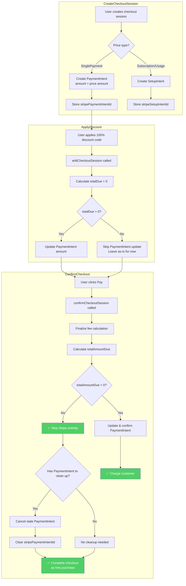

# Option 4: Skip Stripe Entirely for Zero-Total Checkouts

## Overview

Detect when `totalDue === 0` and bypass the Stripe payment flow entirely. Complete the checkout without any PaymentIntent. The key insight is that if nothing is owed, there's no need to interact with Stripe for payment.

## Flow Diagram



## Implementation Changes

### confirmCheckoutSession (confirmCheckoutSession.ts)

The main change is in `confirmCheckoutSession.ts` around lines 181-218:

```typescript
} else if (
  checkoutSession.stripePaymentIntentId &&
  checkoutSession.type !== CheckoutSessionType.AddPaymentMethod &&
  finalFeeCalculation
) {
  const finalizedFeeCalculation = await finalizeFeeCalculation(
    finalFeeCalculation,
    transaction
  )

  const totalAmountDue = calculateTotalDueAmount(finalizedFeeCalculation)

  // NEW: Check if this is a zero-total checkout
  if (totalAmountDue === 0) {
    // Cancel the stale PaymentIntent - we don't need it
    await cancelPaymentIntent(
      checkoutSession.stripePaymentIntentId,
      checkoutSession.livemode
    )

    // Clear the PaymentIntent ID from checkout session
    await updateCheckoutSession(
      {
        ...checkoutSession,
        stripePaymentIntentId: null,
      },
      transaction
    )

    // Continue with checkout completion - no payment needed
  } else {
    // Existing logic for non-zero amounts
    const finalFeeAmount = calculateTotalFeeAmount(finalizedFeeCalculation)
    const paymentIntent = await getPaymentIntent(
      checkoutSession.stripePaymentIntentId
    )

    await updatePaymentIntent(
      checkoutSession.stripePaymentIntentId,
      {
        ...(paymentIntent.customer ? {} : { customer: stripeCustomerId }),
        amount: totalAmountDue,
        application_fee_amount: finalFeeAmount,
        ...(input.savePaymentMethodForFuture
          ? { setup_future_usage: 'on_session' as const }
          : {}),
      },
      checkoutSession.livemode
    )
  }
}
```

### Additional: Stripe utility function (stripe.ts)

Add a new function to cancel PaymentIntents:

```typescript
export const cancelPaymentIntent = async (
  paymentIntentId: string,
  livemode: boolean
): Promise<Stripe.PaymentIntent> => {
  const stripe = getStripeClient(livemode)
  return stripe.paymentIntents.cancel(paymentIntentId)
}
```

## Pros

- Minimal changes required - concentrated in one place
- Handles the problem at the right moment (confirmation time)
- No need to change the discount application flow
- Clean separation: discount logic stays simple, payment logic handles edge cases

## Cons

- PaymentIntent exists until confirmation (slightly wasteful)
- Still need to add cleanup logic
- Does not save payment method (fine for one-time purchases, may need SetupIntent for subscriptions)

## When to Use This Option

Best suited for:
- One-time purchases with 100% off
- Scenarios where you don't need to save the payment method
- Quick fix with minimal codebase changes

Not ideal for:
- Subscriptions where you want to save the payment method for future billing
- Cases where fraud prevention requires validating a real payment method
