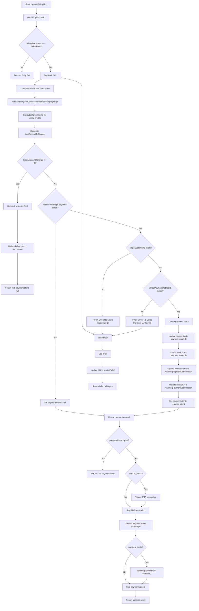

# executeBillingRun Function Flowchart

This document provides a comprehensive flowchart showing all **logical branches** in the `executeBillingRun` function. Sequential steps are shown as linear flows, not branches.

## Main Flow

## Key Branching Points

### 1. **Initial Status Check**
- `billingRun.status !== BillingRunStatus.Scheduled` → Early return

### 2. **Amount Calculation Branch**
- `totalAmountToCharge <= 0` → Skip payment processing, mark as paid
- `totalAmountToCharge > 0` → Proceed with payment intent creation

### 3. **Payment Intent Creation Branch**
- `resultFromSteps.payment` doesn't exist → Set paymentIntent = null
- `resultFromSteps.payment` exists` → Create payment intent (with validation)

### 4. **Stripe Validation Branches**
- Missing `stripeCustomerId` → Throw error
- Missing `stripePaymentMethodId` → Throw error
- Valid credentials → Create payment intent

### 5. **Post-Transaction Processing Branch**
- No payment intent → Return early
- Payment intent exists → Confirm with Stripe

### 6. **Error Handling**
- Any error in try block → Catch, log, mark billing run as failed

## Sequential Steps (Not Branches)

These are **sequential operations** within the transaction, not branches:

1. **executeBillingRunCalculationAndBookkeepingSteps** - Does all the heavy lifting
2. **Get subscription items** - For usage credit grants  
3. **Calculate totalAmountToCharge** - Final amount calculation
4. **Database updates** - Invoice, payment, billing run updates

The key insight is that `executeBillingRunCalculationAndBookkeepingSteps` does its own internal branching (invoice creation, terminal state checks, etc.) but from the main function's perspective, it's just a sequential step that returns a result.

## Terminal States

### Success Paths:
1. **Zero Amount**: Invoice marked as paid, billing run succeeded
2. **Terminal Invoice**: Billing run succeeded, no further processing
3. **Payment Success**: Payment confirmed, charge ID recorded

### Failure Paths:
1. **Missing Stripe Data**: Error thrown, transaction rolled back
2. **Stripe API Failure**: Error caught, billing run marked as failed
3. **Database Errors**: Transaction rolled back, billing run marked as failed

## Error Recovery

All errors are caught in the main try-catch block and result in:
- Billing run status updated to `Failed`
- Error details stored in `errorDetails` field
- Transaction rolled back (automatic with `comprehensiveAdminTransaction`)

## Transaction Boundaries

- **Main Transaction**: All database operations and Stripe payment intent creation
- **Secondary Transaction**: Payment confirmation and charge ID update (outside main transaction)
- **Error Transaction**: Billing run failure status update