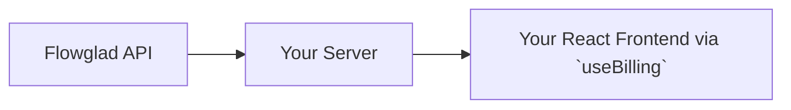
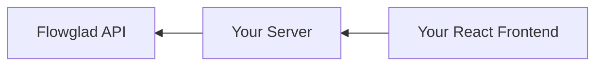
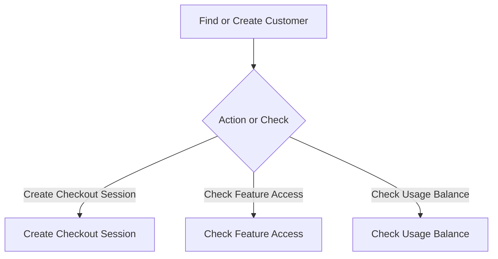
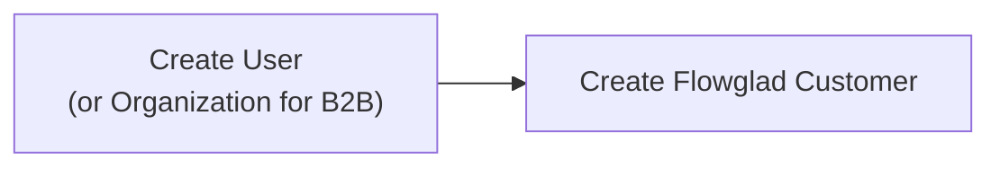

Please help us add Flowglad's payments and billing layer to our product following the guide below.

Flowglad is a payment processor that you can integrate without writing any glue code. It allows you to model your business using **pricing models**, which describe your entire business model, pricing, feature access all in a single schema.

By default, Flowglad integration requires:
- No webhooks to listen to FLowglad events.
- No schema changes to your database
- No data from Flowglad that you need to store in your database

## Core Concepts
### The Data Flow

In a standard Flowglad integration, data flows from Flowglad's API, to your server, and then from your server to your React frontend. The result is that you no longer need to maintain glue code that syncs the data in your application with the data in Flowglad's servers.

Instead of the current webhook-dominant approach, Flowglad is designed to be [reactive](https://en.wikipedia.org/wiki/Reactive_programming). You just read from us the latest billing state for your customer, including what features they are entitled to, what usage credits they have access to. We move the money for you (like a typical payment processor), but then also act as your source of truth for all your customer's billing state.

To understand how it works, look at our typical read and write flows.

#### The Read Flow

#### The Write Flow

+Similarly, mutations flow in reverse: propagating from your frontend, to your server, to our server. This allows us to deliver the data door-to-door to your frontend code, while ensuring that all the data is scoped to the specific customer.

### The Lifecycle
Every Flowglad workflow in your app should start with an attempt to find or create the customer, and then either take an action or check the state.

### Authentication Coupling

On your backend, Flowglad couples closely with your authentication. Workflows that involve Flowglad should first consider who the customer is that you are making requests for. All customers in your database should have corresponding customer records in Flowglad, regardless of whether they are paying.

To achieve this, start by adding a call to [/create-customer](https://docs.flowglad.com/api-reference/customer/create-customer) in your app's account creation flow.

Flowglad manages the billing state for all your customers, including customers on your free plans. That management includes managing which features your customers can access and what balances they have on your product's usage meters.

#### Account Creation Flow

When you refer to your customers with Flowglad, you do so using *your* customer id, rather than ours. If your customers are individuals, use their `user.id` from your database. If your customers are businesses, teams, or other organizations, you can use their `organization.id`.

<Note>
Integrating Flowglad does not require you to make any schema changes to your database. You do not need to store a `flowglad_customer_id` or `flowglad_price_id`.
</Note>

### Implementation 
A full integration of Flowglad consists of essentially 3 steps:
1. Setting up your Flowglad route handler at: `/api/flowglad/(rest...)`
2. Integrating Flowglad customer creation into your authentication flow
3. Mounting `FlowgladProvider` in your React frontend so that you can use the `useBilling` hook

The remainder of the guide will explain how to do all of that.