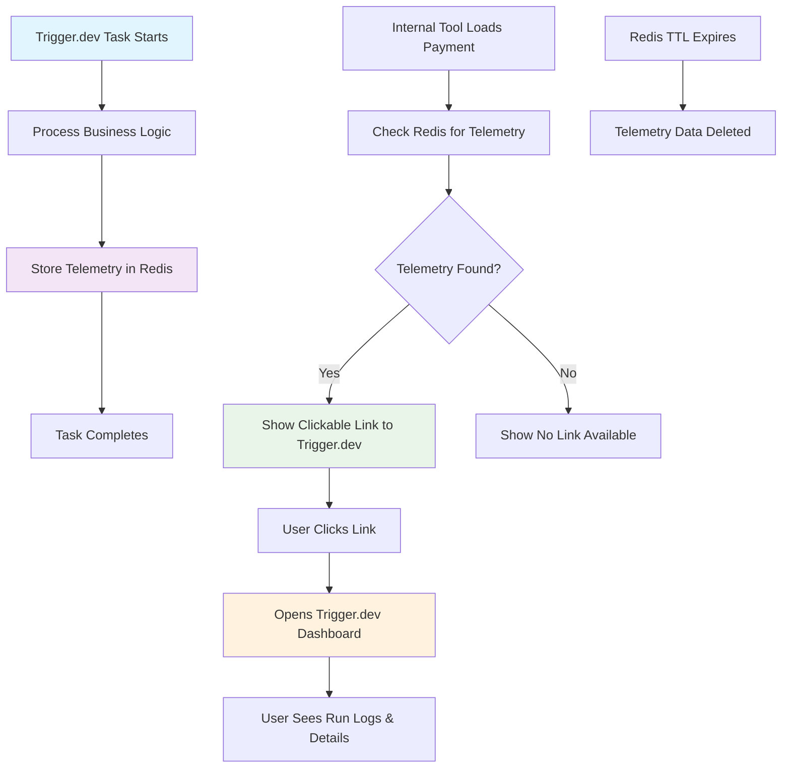

# Telemetry System Implementation Guide - Internal Tool

**⚠️ Important Notice:** This file was generated without specific knowledge of the internal tool's specific workings. This was generated by an agent with knowledge of the main Flowglad webapp. Please adapt these instructions to match your internal tool's actual architecture, patterns, and requirements.

## 1. Plain English Description

### What We're Building
A telemetry system that creates a bridge between your business entities (payments, invoices, billing runs) and the trigger.dev background jobs that process them. When your internal team is debugging issues, they can click from a payment record directly to the trigger.dev run that processed it.

### How It Works
1. **When a trigger.dev task runs**, it stores a simple record in Redis that says "this business entity was processed by this run ID"
2. **When your internal tool displays a payment/invoice/billing run**, it checks Redis to see if there's a corresponding trigger.dev run
3. **If found**, it shows a clickable link that takes you directly to the trigger.dev dashboard for that specific run
4. **The data expires** after 24 hours since trigger.dev runs are only relevant for recent debugging

### Why This Is Useful
- **Debugging payments**: "Why did this payment fail?" → Click through to see the exact trigger.dev run logs
- **Troubleshooting billing**: "Why didn't this subscription get billed?" → See the billing run execution details
- **PDF generation issues**: "Why didn't this invoice PDF generate?" → Check the PDF generation run
- **Webhook problems**: "Did this Stripe webhook get processed?" → Verify webhook processing runs

### What We're NOT Building
- Complex telemetry dashboards
- Real-time monitoring systems  
- Performance analytics
- Long-term data storage

This is a simple debugging tool, not an enterprise observability platform.

## 2. Logic Flow Diagram



## 3. Code Implementation

### Types and Schemas

```typescript
// types/telemetry.ts
export interface TelemetryRecord {
  runId: string
  entityType: 'payment' | 'billing_run' | 'invoice' | 'billing_period' | 'webhook' | 'notification'
  entityId: string
  organizationId: string
  timestamp: string
}

export type TelemetryEntityType = 
  | 'payment'        // Payment table
  | 'billing_run'    // BillingRun table
  | 'invoice'        // Invoice table
  | 'billing_period' // BillingPeriod table
  | 'webhook'        // Webhook events
  | 'notification'   // Notification events
```

### Redis Operations

```typescript
// utils/telemetry.ts
import { redis } from './redis'
import { TelemetryRecord, TelemetryEntityType } from '@/types/telemetry'

const TELEMETRY_TTL = 14 * 24 * 60 * 60 // 14 days in seconds (matches trigger.dev TTL)
const TELEMETRY_NAMESPACE = 'telemetry'

/**
 * Retrieve telemetry data for a business entity
 */
export async function getTelemetry(
  entityType: TelemetryEntityType,
  entityId: string
): Promise<TelemetryRecord | null> {
  const key = `${TELEMETRY_NAMESPACE}:${entityType}:${entityId}`
  const data = await redis.get(key)
  
  if (!data) {
    return null
  }
  
  return JSON.parse(data) as TelemetryRecord
}

/**
 * Generate clickable trigger.dev URL
 */
export function generateTriggerUrl(runId: string): string {
  return `https://cloud.trigger.dev/orgs/flowglad-b012/projects/flowglad-ByMZ/env/prod/runs?runId=${runId}`
}

/**
 * Get telemetry with clickable URL for internal tools
 */
export async function getTelemetryWithUrl(
  entityType: TelemetryEntityType,
  entityId: string
): Promise<{ record: TelemetryRecord; triggerUrl: string } | null> {
  const record = await getTelemetry(entityType, entityId)
  
  if (!record) {
    return null
  }
  
  return {
    record,
    triggerUrl: generateTriggerUrl(record.runId)
  }
}
```

### Internal Tool Integration

```typescript
// In your internal tool components:

// Payment details component
export function PaymentDetails({ payment }: { payment: Payment.Record }) {
  const [telemetry, setTelemetry] = useState<{ record: TelemetryRecord; triggerUrl: string } | null>(null)
  
  useEffect(() => {
    async function loadTelemetry() {
      const data = await getTelemetryWithUrl('payment', payment.id)
      setTelemetry(data)
    }
    loadTelemetry()
  }, [payment.id])
  
  return (
    <div>
      <h2>Payment {payment.id}</h2>
      <p>Amount: ${payment.amount / 100}</p>
      <p>Status: {payment.status}</p>
      
      {telemetry && (
        <div className="telemetry-section">
          <h3>Debug Information</h3>
          <p>
            Processed by trigger.dev run: 
            <a 
              href={telemetry.triggerUrl} 
              target="_blank" 
              rel="noopener noreferrer"
              className="text-blue-600 hover:underline"
            >
              {telemetry.record.runId}
            </a>
          </p>
          <p>Processed at: {new Date(telemetry.record.timestamp).toLocaleString()}</p>
        </div>
      )}
    </div>
  )
}

// Billing run details component  
export function BillingRunDetails({ billingRun }: { billingRun: BillingRun.Record }) {
  const [telemetry, setTelemetry] = useState<{ record: TelemetryRecord; triggerUrl: string } | null>(null)
  
  useEffect(() => {
    async function loadTelemetry() {
      const data = await getTelemetryWithUrl('billing_run', billingRun.id)
      setTelemetry(data)
    }
    loadTelemetry()
  }, [billingRun.id])
  
  return (
    <div>
      <h2>Billing Run {billingRun.id}</h2>
      <p>Status: {billingRun.status}</p>
      
      {telemetry && (
        <div className="telemetry-section">
          <h3>Debug Information</h3>
          <p>
            Executed by trigger.dev run: 
            <a 
              href={telemetry.triggerUrl} 
              target="_blank" 
              rel="noopener noreferrer"
              className="text-blue-600 hover:underline"
            >
              {telemetry.record.runId}
            </a>
          </p>
        </div>
      )}
    </div>
  )
}

// Invoice details component
export function InvoiceDetails({ invoice }: { invoice: Invoice.Record }) {
  const [telemetry, setTelemetry] = useState<{ record: TelemetryRecord; triggerUrl: string } | null>(null)
  
  useEffect(() => {
    async function loadTelemetry() {
      const data = await getTelemetryWithUrl('invoice', invoice.id)
      setTelemetry(data)
    }
    loadTelemetry()
  }, [invoice.id])
  
  return (
    <div>
      <h2>Invoice {invoice.id}</h2>
      <p>Status: {invoice.status}</p>
      
      {telemetry && (
        <div className="telemetry-section">
          <h3>Debug Information</h3>
          <p>
            PDF generated by trigger.dev run: 
            <a 
              href={telemetry.triggerUrl} 
              target="_blank" 
              rel="noopener noreferrer"
              className="text-blue-600 hover:underline"
            >
              {telemetry.record.runId}
            </a>
          </p>
        </div>
      )}
    </div>
  )
}
```

### Redis Configuration

```typescript
// utils/redis.ts (adapt to your internal tool's Redis setup)
import { Redis } from 'ioredis'

// Adapt these environment variables to match your internal tool's setup
const redis = new Redis({
  url: process.env.REDIS_URL || process.env.UPSTASH_REDIS_REST_URL,
  token: process.env.REDIS_TOKEN || process.env.UPSTASH_REDIS_REST_TOKEN,
})

export { redis }
```

## 4. Entity-to-Event Mapping

### **Simple Rule: Store Telemetry for Every Entity Processed**

**Key Principle:** Store telemetry for ALL entities that a trigger.dev task creates, updates, or processes. Use "last write wins" - if multiple runs touch the same entity, the most recent run is the relevant one for debugging.

### **Why This Approach:**
- **Debugging Goal**: "Show me the most recent run that touched this entity"
- **Simple Implementation**: No complex collision handling needed
- **Practical**: Overwriting old data is the desired behavior
- **Comprehensive**: Captures all entity changes, not just primary ones

### **Examples:**

#### **Simple Task - One Entity:**
```typescript
// stripe-payment-intent-succeeded task
export const stripePaymentIntentSucceededTask = task({
  run: async (payload: Stripe.PaymentIntentSucceededEvent, { ctx }) => {
    const payment = await processPayment(payload)
    
    // Store telemetry for the payment entity
    await storeTelemetry('payment', payment.id, ctx.run.id, payment.organizationId)
  }
})
```

#### **Complex Task - Multiple Entities:**
```typescript
// attempt-billing-run task - can store telemetry for multiple entities
export const attemptBillingRunTask = task({
  id: 'attempt-billing-run',
  run: async (payload: { billingRun: BillingRun.Record }, { ctx }) => {
    const runId = ctx.run.id;
    
    // ... existing billing logic ...
    
    // Store telemetry for the billing run entity
    await storeTelemetry(
      'billing_run',
      payload.billingRun.id,
      runId,
      payload.billingRun.organizationId,
      {
        subscriptionId: payload.billingRun.subscriptionId,
        status: 'succeeded'
      }
    )
    
    // ALSO store telemetry for each payment created by this billing run
    const payments = await getPaymentsForBillingRun(payload.billingRun.id);
    for (const payment of payments) {
      await storeTelemetry(
        'payment',
        payment.id,
        runId, // Same run ID for all entities
        payment.organizationId,
        {
          amount: payment.amount,
          currency: payment.currency,
          status: 'succeeded'
        }
      );
    }
    
    return { message: 'Billing run completed' }
  }
})
```

### **Redis Storage Results:**
```
telemetry:payment:pym_123 → {runId: "run_abc", entityType: "payment", ...}
telemetry:invoice:inv_456 → {runId: "run_abc", entityType: "invoice", ...}
telemetry:billing_run:br_789 → {runId: "run_abc", entityType: "billing_run", ...}
```

### **Internal Tool Results:**
- Click on Payment `pym_123` → Shows link to `run_abc`
- Click on Invoice `inv_456` → Shows link to `run_abc`  
- Click on Billing Run `br_789` → Shows link to `run_abc`

### **Overwrite Behavior (Last Write Wins):**
```typescript
// Run 1: Creates payment
await storeTelemetry('payment', 'pym_123', 'run_abc', 'org_1')

// Run 2: Updates the same payment (overwrites)
await storeTelemetry('payment', 'pym_123', 'run_xyz', 'org_1')

// Result: telemetry:payment:pym_123 → {runId: "run_xyz", ...}
// When debugging payment pym_123, you see the most recent run that touched it
```


## 5. Code Organization

### **This Codebase (Internal Tool)**
- ✅ **Types and Schemas** (`types/telemetry.ts`)
- ✅ **Redis Operations** (`utils/telemetry.ts`) 
- ✅ **Internal Tool Components** (PaymentDetails, BillingRunDetails, InvoiceDetails)
- ✅ **Frontend React components** that call Redis directly

### **Main Flowglad App (Separate)**
- ✅ **Trigger.dev Task Integration** (modify existing tasks in `src/trigger/`)
- ✅ **Telemetry Storage** (when tasks run)

## 5. Implementation Checklist for Internal Tool

### Phase 1: Core Infrastructure
- [ ] **Determine Redis access method** - Does your internal tool have direct Redis access or do you need API endpoints?
- [ ] **Verify internal tool API routes have proper authentication** - Ensure only Flowglad engineers can access telemetry data
- [ ] Create `types/telemetry.ts` with `TelemetryRecord`, `TelemetryEntityType`, and `TelemetryMetadata` interfaces
- [ ] Create `utils/telemetry.ts` with `getTelemetry()`, `getTelemetryWithUrl()`, and `generateTriggerUrl()` functions
- [ ] Set up Redis connection (direct access or API calls)
- [ ] Add telemetry types to your main types export
- [ ] Test Redis connection and basic telemetry retrieval
- [ ] **Note: tRPC provides automatic caching** - no additional caching needed

### Phase 2: Component Integration
- [ ] **Identify existing components** that display payments, invoices, billing runs
- [ ] Add telemetry display to payment detail components
- [ ] Add telemetry display to billing run detail components  
- [ ] Add telemetry display to invoice detail components
- [ ] Add telemetry display to webhook processing components
- [ ] Add telemetry display to notification components
- [ ] **Adapt component patterns** to match your internal tool's architecture
- [ ] **Update routing/navigation** if needed to support telemetry links

### Phase 3: UI/UX Integration
- [ ] **Design telemetry section** that fits your internal tool's UI patterns
- [ ] Add clickable links to trigger.dev dashboard
- [ ] Add loading states for telemetry data
- [ ] Add error handling for missing telemetry data
- [ ] **Style telemetry links** to match your design system
- [ ] Add tooltips or help text explaining what trigger.dev links are
- [ ] **Test responsive design** for telemetry sections

### Phase 4: Testing and Validation
- [ ] Test telemetry retrieval for payment entities
- [ ] Test telemetry retrieval for billing run entities
- [ ] Test telemetry retrieval for invoice entities
- [ ] Test telemetry retrieval for webhook entities
- [ ] Test telemetry retrieval for notification entities
- [ ] Verify trigger.dev URLs are correct and clickable
- [ ] Test error handling when Redis is unavailable
- [ ] Test error handling when telemetry data is missing
- [ ] **Test with real data** from your main Flowglad app
- [ ] **Validate trigger.dev organization/project IDs** are correct

### Phase 5: Documentation and Cleanup
- [ ] **Document telemetry integration** in your internal tool's docs
- [ ] Add telemetry examples to component documentation
- [ ] Document Redis key patterns and TTL policies
- [ ] **Update user guides** to explain trigger.dev links
- [ ] **Train internal team** on using telemetry for debugging
- [ ] **Add telemetry to any new components** that display business entities
- [ ] **Monitor telemetry usage** and gather feedback from internal team

## 6. Key Considerations for Internal Tool

### **Architecture Questions to Resolve**
- [ ] **How does your internal tool access data?** (Direct DB, API calls, etc.)
- [ ] **What's your Redis setup?** (Shared with main app, separate instance, etc.)
- [ ] **How do you handle authentication?** (Same as main app, separate system, etc.)
- [ ] **What's your component architecture?** (React, Vue, Angular, etc.)
- [ ] **How do you handle routing?** (Next.js, React Router, etc.)

### **Integration Patterns to Consider**
- [ ] **Data fetching patterns** - How do you currently load business entity data?
- [ ] **Error handling patterns** - How do you handle missing or failed data?
- [ ] **Loading state patterns** - How do you show loading states?
- [ ] **Styling patterns** - How do you style external links and debug information?

### **Testing Strategy**
- [ ] **Unit tests** for telemetry utility functions
- [ ] **Integration tests** for Redis connectivity
- [ ] **Component tests** for telemetry display
- [ ] **End-to-end tests** for click-through functionality
- [ ] **User acceptance testing** with internal team

## 7. Success Criteria

- [ ] Internal team can click from any business entity to its corresponding trigger.dev run
- [ ] Telemetry links work correctly and open the right trigger.dev dashboard
- [ ] Missing telemetry data is handled gracefully
- [ ] Performance impact is minimal
- [ ] Internal team finds telemetry useful for debugging
- [ ] System works reliably in production
- [ ] Documentation is clear and helpful

## 8. Notes for Implementation

- **Start small** - Begin with payment entities, then expand to other entity types
- **Test frequently** - Verify telemetry data is being stored by the main app
- **Monitor performance** - Ensure Redis lookups don't slow down your internal tool
- **Gather feedback** - Ask your internal team what telemetry information is most useful
- **Iterate quickly** - Adjust the telemetry display based on actual usage patterns

Remember: This is a debugging tool, not a monitoring system. Keep it simple and focused on helping your internal team quickly jump from business entities to trigger.dev runs.
