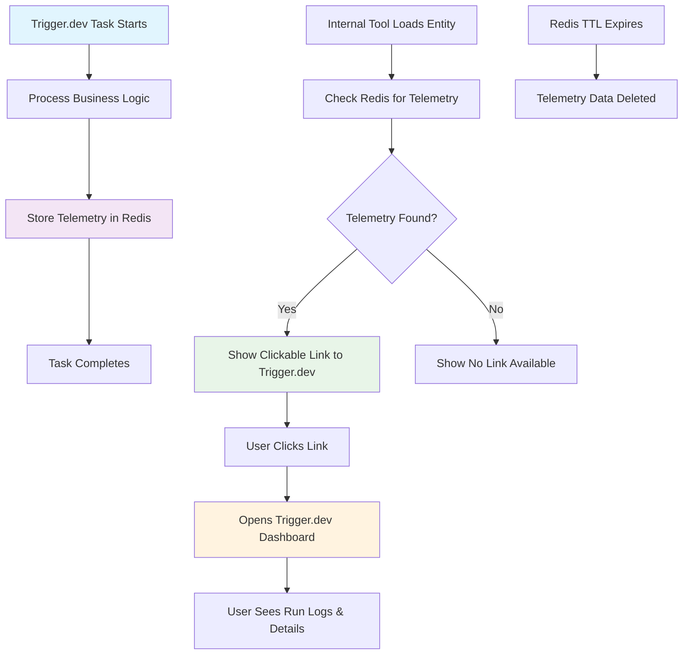

# Telemetry System - Definitive Specification

## 1. Overview

### What We're Building
A telemetry system that creates a bridge between business entities (payments, invoices, billing runs) and trigger.dev background jobs that process them. When debugging issues, internal teams can click from a business entity directly to the trigger.dev run that processed it.

### How It Works
1. **Trigger.dev tasks store telemetry** in Redis when they process business entities
2. **Internal tool displays telemetry links** next to business entities
3. **Clicking the link** opens the trigger.dev dashboard for that specific run
4. **Data expires after 14 days** to match trigger.dev's run retention

### Why This Is Useful
- **Debugging payments**: "Why did this payment fail?" → Click through to see the exact trigger.dev run logs
- **Troubleshooting billing**: "Why didn't this subscription get billed?" → See the billing run execution details
- **PDF generation issues**: "Why didn't this invoice PDF generate?" → Check the PDF generation run
- **Webhook problems**: "Did this Stripe webhook get processed?" → Verify webhook processing runs

## 2. Architecture Diagram



## 3. Configuration

### Redis Configuration
```yaml
telemetry:
  ttl: 1209600  # 14 days in seconds (matches trigger.dev TTL)
  namespace: "telemetry"
  eviction_policy: "ex"
```

### Environment Variables
```bash
# Redis Configuration
UPSTASH_REDIS_REST_URL=https://your-redis.upstash.io
UPSTASH_REDIS_REST_TOKEN=your-redis-token

# Trigger.dev Configuration  
TRIGGER_SECRET_KEY=tr_dev_your-secret-key
```

## 4. API / Protocol

### Data Types
```typescript
// Telemetry record stored in Redis
export interface TelemetryRecord {
  runId: string
}

// Entity types that can have telemetry
export type TelemetryEntityType =
  | 'payment'        // Payment table
  | 'billing_run'    // BillingRun table
  | 'invoice'        // Invoice table
  | 'billing_period' // BillingPeriod table
  | 'webhook'        // Webhook events
  | 'notification'   // Notification events
```

### Redis Key Pattern
```
telemetry:{entityType}:{entityId} → {runId: string}
```

### Functions
```typescript
// Store telemetry (called by trigger.dev tasks)
storeTelemetry(entityType: TelemetryEntityType, entityId: string, runId: string): Promise<void>

// Retrieve telemetry (called by internal tool)
getTelemetry(entityType: TelemetryEntityType, entityId: string): Promise<TelemetryRecord | null>

// Get telemetry with clickable URL
getTelemetryWithUrl(entityType: TelemetryEntityType, entityId: string): Promise<{record: TelemetryRecord, triggerUrl: string} | null>
```

## 5. Phases & Tasks

### Phase 1: Core Infrastructure (Main App)
- [ ] Create `src/types.ts` with `TelemetryRecord` and `TelemetryEntityType` interfaces
- [ ] Create `src/utils/redis.ts` with `storeTelemetry()` function
- [ ] Add telemetry to `RedisKeyNamespace` enum
- [ ] Add telemetry eviction policy (14 days TTL)
- [ ] Test Redis connection and telemetry storage

### Phase 2: Trigger.dev Integration (Main App)
- [ ] Add telemetry to `src/trigger/attempt-billing-run.ts`
- [ ] Add telemetry to `src/trigger/stripe/payment-intent-succeeded.ts`
- [ ] Add telemetry to `src/trigger/supabase/event-inserted.ts`
- [ ] Add telemetry to `src/trigger/notifications/send-customer-payment-succeeded-notification.ts`
- [ ] Add telemetry to remaining trigger.dev tasks as needed

### Phase 3: Internal Tool Integration
- [ ] Determine Redis access method (direct or API)
- [ ] Create telemetry utility functions for internal tool
- [ ] Add telemetry display to payment detail components
- [ ] Add telemetry display to billing run detail components
- [ ] Add telemetry display to invoice detail components
- [ ] Add telemetry display to webhook processing components
- [ ] Add telemetry display to notification components

### Phase 4: Testing and Validation
- [ ] Test telemetry storage for all entity types
- [ ] Test telemetry retrieval in internal tool
- [ ] Verify trigger.dev URLs are correct and clickable
- [ ] Test error handling when Redis is unavailable
- [ ] Test error handling when telemetry data is missing
- [ ] Validate trigger.dev organization/project IDs

### Phase 5: Documentation and Cleanup
- [ ] Document telemetry integration in both codebases
- [ ] Add telemetry examples to component documentation
- [ ] Update user guides to explain trigger.dev links
- [ ] Train internal team on using telemetry for debugging

## 6. Testing Strategy

### Unit Tests
- [ ] Test `storeTelemetry()` function with valid inputs
- [ ] Test `storeTelemetry()` function with invalid inputs
- [ ] Test `getTelemetry()` function with existing data
- [ ] Test `getTelemetry()` function with missing data
- [ ] Test Redis connection and error handling

### Integration Tests
- [ ] Test telemetry storage in trigger.dev tasks
- [ ] Test telemetry retrieval in internal tool components
- [ ] Test end-to-end flow from task execution to Redis storage
- [ ] Test trigger.dev URL generation and validation

### User Acceptance Testing
- [ ] Internal team can click from business entities to trigger.dev runs
- [ ] Telemetry links work correctly and open the right dashboard
- [ ] Missing telemetry data is handled gracefully
- [ ] Performance impact is minimal

## 7. Monitoring & Metrics

### Key Metrics
- **Telemetry storage success rate**: Percentage of successful telemetry storage operations
- **Telemetry retrieval success rate**: Percentage of successful telemetry retrieval operations
- **Redis connection health**: Monitor Redis connectivity and response times
- **Trigger.dev URL click-through rate**: Track usage of telemetry links

### Logging
```typescript
// Success logging
logger.info('Telemetry stored', {
  entityType,
  entityId,
  runId,
  triggerUrl: generateTriggerUrl(runId)
})

// Error logging
logger.warn('Telemetry storage failed', {
  error: error.message,
  entityType,
  entityId,
  runId
})
```

## 8. Deployment

### Main App (Flowglad Next.js)
- [ ] Deploy telemetry types and Redis functions
- [ ] Deploy updated trigger.dev tasks with telemetry calls
- [ ] Verify Redis connection and telemetry storage
- [ ] Monitor telemetry storage success rate

### Internal Tool
- [ ] Deploy telemetry utility functions
- [ ] Deploy updated components with telemetry display
- [ ] Verify Redis access and telemetry retrieval
- [ ] Test trigger.dev URL generation

## 9. Success Criteria

- [ ] Internal team can click from any business entity to its corresponding trigger.dev run
- [ ] Telemetry links work correctly and open the right trigger.dev dashboard
- [ ] Missing telemetry data is handled gracefully
- [ ] Performance impact is minimal (< 100ms for telemetry operations)
- [ ] Internal team finds telemetry useful for debugging
- [ ] System works reliably in production
- [ ] Documentation is clear and helpful

## 10. Entity-to-Event Mapping

### Simple Rule: Store Telemetry for Every Entity Processed

**Key Principle:** Store telemetry for ALL entities that a trigger.dev task creates, updates, or processes. Use "last write wins" - if multiple runs touch the same entity, the most recent run is the relevant one for debugging.

### Examples

#### Simple Task - One Entity:
```typescript
// stripe-payment-intent-succeeded task
export const stripePaymentIntentSucceededTask = task({
  run: async (payload: Stripe.PaymentIntentSucceededEvent, { ctx }) => {
    const payment = await processPayment(payload)
    
    // Store telemetry for the payment entity
    await storeTelemetry('payment', payment.id, ctx.run.id)
  }
})
```

#### Complex Task - Multiple Entities:
```typescript
// attempt-billing-run task - stores telemetry for multiple entities
export const attemptBillingRunTask = task({
  id: 'attempt-billing-run',
  run: async (payload: { billingRun: BillingRun.Record }, { ctx }) => {
    const runId = ctx.run.id;
    
    // ... existing billing logic ...
    
    // Store telemetry for the billing run entity
    await storeTelemetry('billing_run', payload.billingRun.id, runId)
    
    // ALSO store telemetry for each payment created by this billing run
    const payments = await getPaymentsForBillingRun(payload.billingRun.id);
    for (const payment of payments) {
      await storeTelemetry('payment', payment.id, runId);
    }
    
    return { message: 'Billing run completed' }
  }
})
```

### Redis Storage Results:
```
telemetry:payment:pym_123 → {runId: "run_abc"}
telemetry:invoice:inv_456 → {runId: "run_abc"}
telemetry:billing_run:br_789 → {runId: "run_abc"}
```

### Internal Tool Results:
- Click on Payment `pym_123` → Shows link to `run_abc`
- Click on Invoice `inv_456` → Shows link to `run_abc`  
- Click on Billing Run `br_789` → Shows link to `run_abc`

### Overwrite Behavior (Last Write Wins):
```typescript
// Run 1: Creates payment
await storeTelemetry('payment', 'pym_123', 'run_abc')

// Run 2: Updates the same payment (overwrites)
await storeTelemetry('payment', 'pym_123', 'run_xyz')

// Result: telemetry:payment:pym_123 → {runId: "run_xyz"}
// When debugging payment pym_123, you see the most recent run that touched it
```

## 11. Implementation Notes

### Error Handling
- **Telemetry is a side effect** - failures should not affect main business logic
- **Use try-catch blocks** around all telemetry operations
- **Log errors** but don't throw exceptions
- **Graceful degradation** when Redis is unavailable

### Performance Considerations
- **Single Redis operation** per entity (minimal performance impact)
- **Async operations** to avoid blocking main task execution
- **TTL-based cleanup** to prevent Redis bloat
- **Connection pooling** for Redis operations

### Security Considerations
- **Internal tool access only** - ensure proper authentication
- **Redis access control** - limit access to telemetry data
- **No sensitive data** in telemetry records (only run IDs)
- **Audit logging** for telemetry access

This definitive specification provides a complete, unified approach to implementing the telemetry system across both the main Flowglad app and the internal tool.
